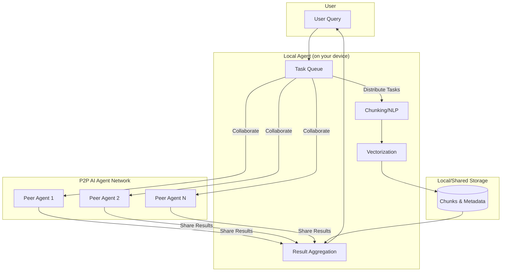

# Distributed Peer-to-Peer AI Agents

## Vision

This project aims to democratize AI by building a distributed, peer-to-peer (P2P) network of lightweight AI agents. Anyone can contribute their idle compute (PC, server, Raspberry Pi, etc.) to help process, chunk, and retrieve data—reducing the need for centralized, energy-intensive datacenters and making AI accessible to all.

## Why?

- **Sustainability:** Use existing, underutilized hardware instead of building new datacenters.
- **Privacy:** Data stays local wherever possible, with federated and secure processing.
- **Resilience:** No single point of failure; network grows stronger as more people join.
- **Accessibility:** Anyone can participate, contribute, and benefit from the network.

## High-Level Architecture



## Features

- **Lightweight Agents:** Run on laptops, desktops, Raspberry Pis, etc.
- **Peer Discovery:** Agents find each other and share workloads (libp2p/IPFS compatible).
- **Task Distribution:** Tasks like chunking, NLP, and retrieval are distributed across peers.
- **Federated Learning:** (Future) Share model updates, not raw data, for privacy and efficiency.
- **Energy Awareness:** Schedule tasks when devices are idle or using renewable energy.

## Getting Started

1. Clone this repo.
2. Install dependencies.
3. Launch your agent:  
   ```bash
   python run_agent.py
   ```
4. Your agent will join the public P2P network and start collaborating!

## Roadmap

- [ ] Minimal agent prototype (task queue + chunking)
- [ ] P2P networking (peer discovery, secure comms)
- [ ] Distributed task scheduling
- [ ] Result aggregation and feedback
- [ ] Federated learning
- [ ] Energy-aware scheduling
- [ ] Real-world applications and demos

## Contributing

- Open issues for bugs, features, or questions.
- PRs welcome!
- See [CONTRIBUTING.md](CONTRIBUTING.md) for guidelines.

## License

MIT or Apache 2.0 (to be decided by community).

## MVP Peer-to-Peer Considerations

- **Security & Authentication:** Agents use cryptographic keypairs for identity and sign all messages. Communication is encrypted.
- **Fault Tolerance:** Agents detect failures and reassign or retry tasks as needed.
- **Message/Task Format:** All agent messages use a simple JSON structure with type, task_id, payload, sender_id, and signature fields.
- **Network Bootstrap:** New agents join via a known bootstrap node or multicast discovery, then find more peers.
- **Monitoring & Logging:** Agents log key events and errors for transparency and debugging.

---

*Let’s build a greener, open, and decentralized AI future—together!*
