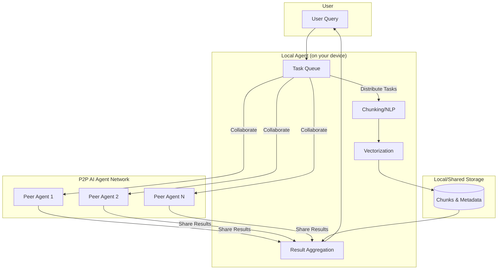

# Distributed Peer-to-Peer AI Agents

[](LICENSE)
[](https://python.org)
[](https://github.com/yourusername/p2p-agent)
[](CONTRIBUTING.md)

## Vision

This project aims to democratize AI by building a distributed, peer-to-peer (P2P) network of lightweight AI agents. Anyone can contribute their idle compute (PC, server, Raspberry Pi, etc.) to help process, chunk, and retrieve data—reducing the need for centralized, energy-intensive datacenters and making AI accessible to all.

**🌟 Join the movement to build a sustainable, decentralized AI future!**

## Why P2P AI Agents?

### 🌱 **Sustainability**
- **Energy Efficient**: Utilize existing, underutilized hardware instead of building new energy-intensive datacenters
- **Carbon Footprint**: Reduce CO2 emissions by leveraging distributed computing resources
- **Renewable Integration**: Smart scheduling to use renewable energy when available

### 🔒 **Privacy & Security**
- **Data Sovereignty**: Data stays local wherever possible, with federated and secure processing
- **End-to-End Encryption**: All communications are cryptographically secured
- **Zero-Knowledge Processing**: Agents can process data without accessing raw content

### 🌐 **Resilience & Decentralization**
- **No Single Point of Failure**: Network grows stronger as more people join
- **Fault Tolerance**: Automatic failover and task redistribution
- **Censorship Resistance**: Decentralized architecture prevents shutdown

### 🤝 **Accessibility & Inclusion**
- **Anyone Can Participate**: From Raspberry Pi to high-end servers
- **Economic Incentives**: Contributors can earn rewards for sharing resources
- **Global Collaboration**: Connect AI enthusiasts worldwide

## High-Level Architecture



## Use Cases

### 🔍 **Distributed Document Processing**
Process large document collections across multiple devices for search, summarization, and analysis.

### 🧠 **Collaborative Machine Learning**
Train models collectively while keeping data private using federated learning techniques.

### 📊 **Distributed Data Analysis**
Analyze datasets too large for single machines by distributing computation across the network.

### 🌐 **Content Moderation**
Decentralized content filtering and moderation for social platforms and forums.

### 📚 **Knowledge Graph Construction**
Build comprehensive knowledge graphs from distributed data sources.

### 🔄 **Real-time Stream Processing**
Process continuous data streams from IoT devices and sensors.

## Architecture Examples

### Example 1: Document Search System
```
User Query → Local Agent → [Chunk, Vectorize, Search] → Peer Network → Results
```

### Example 2: Federated Learning
```
Local Data → Training Agent → Model Updates → Aggregator → Global Model
```

### Example 3: Distributed Storage
```
Large File → Chunking Agent → Storage Peers → Redundant Copies → Retrieval
```

## Features

### 🚀 **Core Capabilities**

- **Lightweight Agents**: Run efficiently on laptops, desktops, Raspberry Pis, and edge devices
- **Intelligent Peer Discovery**: Agents find each other automatically using libp2p/IPFS protocols
- **Dynamic Task Distribution**: Smart load balancing across available peers based on capabilities
- **Federated Learning**: Share model updates without exposing raw data
- **Energy-Aware Scheduling**: Optimize processing during low-cost or renewable energy periods

### 🔧 **Technical Features**

- **Multi-Protocol Support**: WebSocket, libp2p, IPFS integration
- **Cryptographic Security**: Ed25519 signatures and encrypted communications
- **Fault Tolerance**: Automatic peer failure detection and task redistribution
- **Reputation System**: Trust-based peer scoring for reliable collaboration
- **Resource Monitoring**: Real-time CPU, memory, and network usage tracking
- **Modular Architecture**: Plugin-based system for easy extension

### 🎯 **Specialized Agent Types**

- **Processing Agents**: Handle chunking, NLP, and data transformation
- **Vector Agents**: Specialized in embeddings and similarity search
- **Storage Agents**: Provide distributed data storage and retrieval
- **Coordinator Agents**: Manage task orchestration and result aggregation
- **Gateway Agents**: Bridge between P2P network and external APIs

## Quick Start

### Prerequisites

- Python 3.8 or higher
- Git
- 2GB+ RAM (4GB recommended)
- Stable internet connection

### Installation

1. **Clone the repository**

   ```bash
   git clone https://github.com/yourusername/p2p-agent.git
   cd p2p-agent
   ```

2. **Set up Python environment**

   ```bash
   python -m venv venv
   source venv/bin/activate  # On Windows: venv\Scripts\activate
   ```

3. **Install dependencies**

   ```bash
   pip install -r requirements.txt
   ```

4. **Configure your agent**

   ```bash
   cp config/agent.example.yaml config/agent.yaml
   # Edit config/agent.yaml with your preferences
   ```

5. **Launch your agent**

   ```bash
   python run_agent.py --config config/agent.yaml
   ```

6. **Verify connection**
   
   Your agent will automatically join the network and start collaborating! Check the logs for successful peer connections.

### Docker Setup (Alternative)

```bash
docker build -t p2p-agent .
docker run -d --name my-agent -p 8080:8080 p2p-agent
```

### First Steps

- **Monitor your agent**: Visit `http://localhost:8080/dashboard` for the web UI
- **Check network status**: Use `python cli.py status` to see connected peers
- **Submit a test task**: Try `python cli.py submit --task "hello world"`
- **View logs**: Check `logs/agent.log` for detailed activity

## Project Status and Roadmap

For detailed information about the project's development status, upcoming features, and long-term vision, please see our [Roadmap](ROADMAP.md).

## FAQ

### General Questions

**Q: What hardware do I need to run an agent?**
A: Any device with Python 3.8+, 2GB RAM, and internet connection. Raspberry Pi 4, laptops, desktops, and servers all work great.

**Q: Is my data safe and private?**
A: Yes! Data processing uses encryption, federated approaches, and agents never store raw data unnecessarily. You control what data your agent processes.

**Q: How do I earn rewards for contributing compute?**
A: The reputation system tracks your contributions. Future versions will integrate with blockchain-based incentive mechanisms.

**Q: Can I run multiple agents?**
A: Absolutely! You can run different types of agents (processing, storage, etc.) on the same machine or across multiple devices.

### Technical Questions

**Q: What AI tasks are supported?**
A: Currently: text chunking, embeddings, similarity search, and basic NLP. We're adding image processing, speech recognition, and more.

**Q: How does the P2P network handle failures?**
A: Agents use heartbeat monitoring, automatic failover, and task redistribution. The network is designed to be resilient to node failures.

**Q: Can I develop custom agents?**
A: Yes! The plugin architecture allows custom agent types. See the [Developer Guide](docs/DEVELOPER_GUIDE.md) for details.

**Q: What about network security?**
A: All communications use encryption, agents authenticate with cryptographic signatures, and we implement reputation-based trust.

## Contributing

We welcome contributions from developers, researchers, and enthusiasts! Here are ways you can help:

### 🛠 **Development**
- Core agent development (Python, networking, AI/ML)
- Frontend/dashboard development (React, Vue, or similar)
- Mobile app development for agent management
- Documentation and tutorials

### 🧪 **Testing & Research**
- Beta testing on different hardware configurations
- Performance benchmarking and optimization
- Security research and auditing
- Academic research and paper writing

### 🎨 **Design & UX**
- User interface design for agent dashboard
- Logo, branding, and visual identity
- User experience research and testing
- Documentation design and formatting

### 📚 **Documentation**
- Code documentation and API references
- User guides and tutorials
- Video tutorials and demos
- Translation to other languages

### 🌍 **Community**
- Discord/Slack community management
- Social media and outreach
- Conference talks and presentations
- Workshop and hackathon organization

**Get Started**: Check out our [Contributing Guide](CONTRIBUTING.md) and [Good First Issues](https://github.com/yourusername/p2p-agent/labels/good%20first%20issue)

## Community & Support

### 💬 **Get Help**
- 📖 [Documentation](https://p2p-agent.readthedocs.io/)
- 💬 [Discord Community](https://discord.gg/p2p-agent)
- 🐛 [Report Issues](https://github.com/yourusername/p2p-agent/issues)
- 📧 [Email Support](mailto:support@p2p-agent.org)

### 🤝 **Community Resources**
- [Weekly Community Calls](https://calendar.google.com/p2p-agent-calls)
- [Developer Blog](https://blog.p2p-agent.org/)
- [Research Papers](https://research.p2p-agent.org/)
- [Twitter Updates](https://twitter.com/P2PAgent)

## License

This project is licensed under the MIT License - see the [LICENSE](LICENSE) file for details.

**Open Source Commitment**: We believe in open, collaborative development. All core components will remain open source forever.

## Acknowledgments

- Thanks to the [libp2p](https://libp2p.io/) team for networking protocols
- Inspired by [IPFS](https://ipfs.io/) for distributed storage concepts  
- Built with amazing open source AI tools from [Hugging Face](https://huggingface.co/)
- Special thanks to all our [contributors](CONTRIBUTORS.md) and community members

## Security

For security vulnerabilities, please email [security@p2p-agent.org](mailto:security@p2p-agent.org) instead of using public issues.

## Citation

If you use this project in your research, please cite:

```bibtex
@software{p2p_agent,
  title={Distributed Peer-to-Peer AI Agents},
  author={P2P Agent Contributors},
  year={2025},
  url={https://github.com/yourusername/p2p-agent}
}
```

## MVP Peer-to-Peer Considerations

- **Security & Authentication:** Agents use cryptographic keypairs for identity and sign all messages. Communication is encrypted.
- **Fault Tolerance:** Agents detect failures and reassign or retry tasks as needed.
- **Message/Task Format:** All agent messages use a simple JSON structure with type, task_id, payload, sender_id, and signature fields.
- **Network Bootstrap:** New agents join via a known bootstrap node or multicast discovery, then find more peers.
- **Monitoring & Logging:** Agents log key events and errors for transparency and debugging.

---

*Let's build a greener, open, and decentralized AI future—together!*

---

## 📏 500-Line Limit Policy

**P2P Agent enforces a strict 500-line maximum for all files** to ensure compatibility with small language models and resource-constrained environments.

### Why 500 Lines?

- **🤖 AI Model Compatibility**: Small models can process files under 500 lines efficiently
- **💻 Resource Efficiency**: Lower memory footprint and faster processing
- **👥 Developer Experience**: Easier code review and better maintainability
- **🔄 Modularity**: Forces good architectural decisions and separation of concerns

### Enforcement

- **Automated checks** in pre-commit hooks and CI/CD
- **Code review requirements** for all pull requests
- **Refactoring triggers** when files approach 400 lines
- **Documentation splits** with table of contents approach

See the complete **[500-Line Limit Policy](docs/500_LINE_LIMIT_POLICY.md)** for detailed guidelines and implementation strategies.

---

## 📖 Related Documentation

- **[Documentation Index](docs/INDEX.md)** - Complete documentation overview
- **[Quick Reference](docs/QUICK_REFERENCE.md)** - Commands and configuration quick reference
- **[High Level Design](HIGH_LEVEL_DESIGN.md)** - Technical architecture
- **[Agent Protocol](AGENT_PROTOCOL.md)** - Communication protocol specification
- **[Contributing Guide](CONTRIBUTING.md)** - Development and contribution guidelines

---
