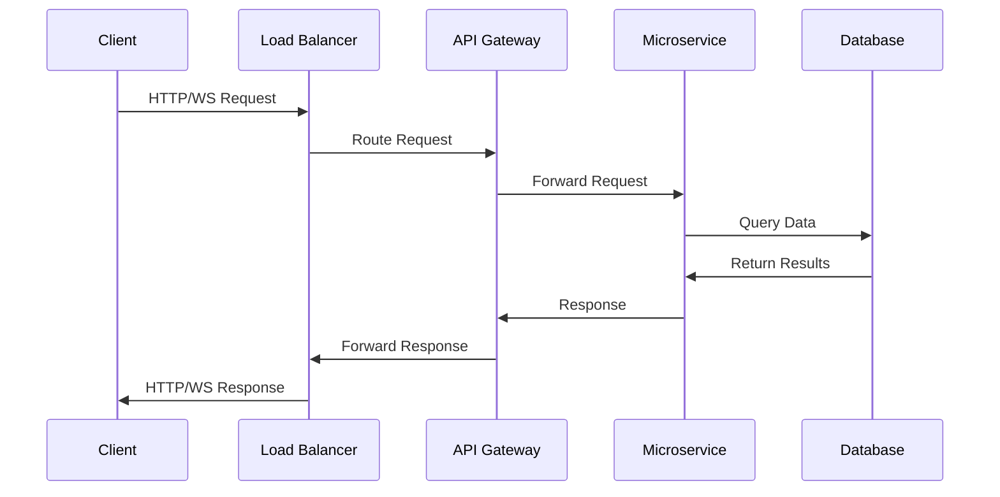
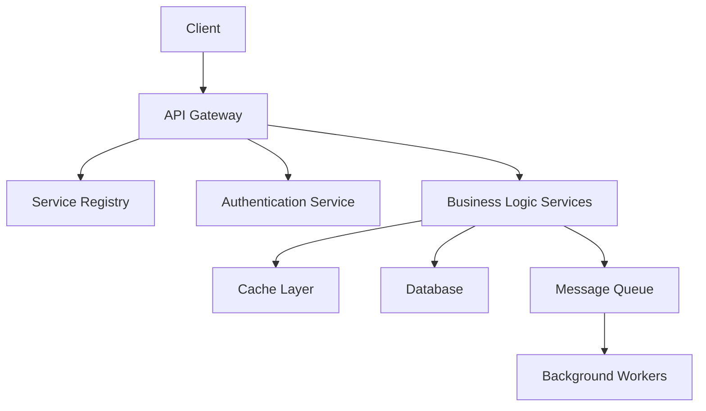
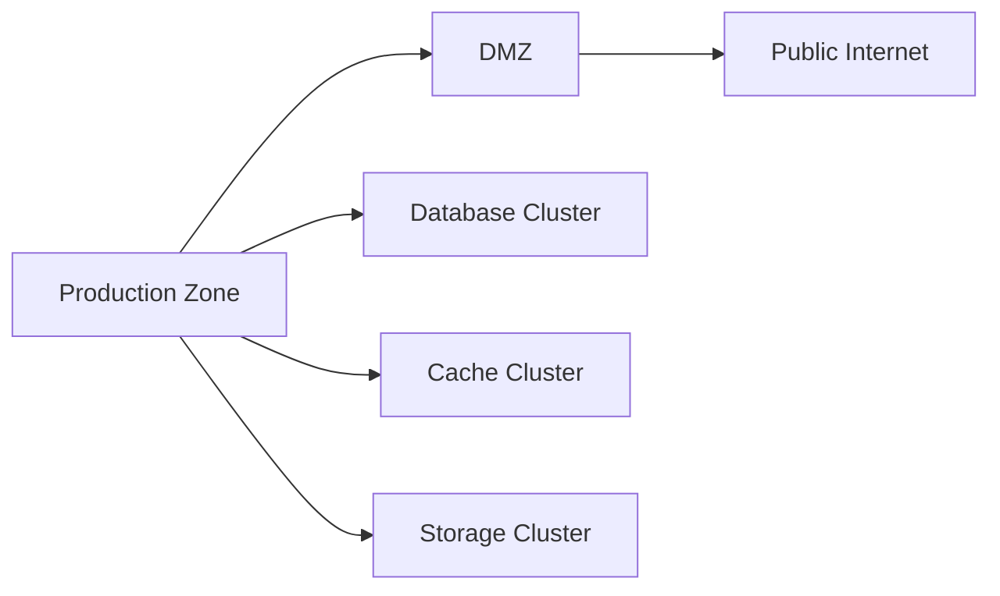

# Architecture Overview

## 1. System Components

### 1.1 Frontend Layer
- Single Page Application (SPA) built with React
- Progressive Web App (PWA) capabilities
- Client-side state management using Redux
- Responsive design for multiple device types

### 1.2 Backend Layer
- Microservices architecture
- RESTful API services
- Message queue system for asynchronous processing
- WebSocket server for real-time communications

### 1.3 Data Layer
- Primary relational database (PostgreSQL)
- Cache layer (Redis)
- Document storage (MongoDB)
- Search engine (Elasticsearch)

### 1.4 Infrastructure Layer
- Container orchestration (Kubernetes)
- Load balancers
- CDN integration
- Monitoring and logging systems

## 2. Component Interactions

### 2.1 Request Flow

### 2.2 Data Flow

## 3. Cross-Cutting Concerns

### 3.1 Security
- Authentication and authorization services
- SSL/TLS encryption
- API gateway security filters
- Data encryption at rest

### 3.2 Monitoring
- Centralized logging
- Metrics collection
- Performance monitoring
- Health checks

### 3.3 Scalability
- Horizontal scaling capabilities
- Auto-scaling policies
- Load balancing strategies
- Database sharding

## 4. Deployment Architecture

### 4.1 Production Environment

### 4.2 Disaster Recovery
- Geographic redundancy
- Backup systems
- Failover procedures
- Data replication

## 5. Integration Points

### 5.1 External Services
- Third-party API integrations
- Payment gateways
- Email/SMS services
- Analytics services

### 5.2 Internal Services
- Service mesh
- Service discovery
- Configuration management
- Secret management

## 6. System Requirements

### 6.1 Hardware Requirements
- Minimum CPU specifications
- Memory requirements
- Storage capacity
- Network bandwidth

### 6.2 Software Requirements
- Operating system compatibility
- Runtime dependencies
- Third-party software
- Development tools

## 7. Future Considerations

### 7.1 Scalability Plans
- Vertical scaling options
- Geographic expansion
- Service mesh evolution
- Cache strategy improvements

### 7.2 Technology Upgrade Path
- Framework updates
- Database migration plans
- Infrastructure modernization
- Security enhancements

This architecture overview provides a comprehensive foundation for understanding the system's structure and components. Detailed specifications for each component can be found in their respective documentation sections.