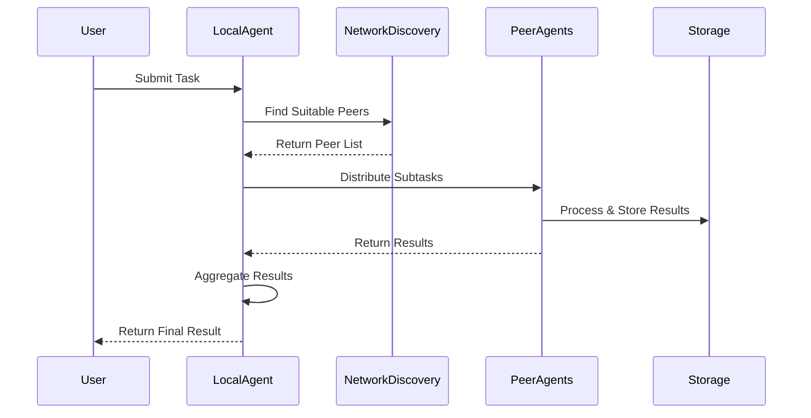

# High Level Design: Distributed Peer-to-Peer AI Agents

## 1. Overview

This document outlines the comprehensive architecture, design decisions, and implementation strategy for building a distributed, peer-to-peer (P2P) network of lightweight AI agents. The system enables collaborative AI processing using underutilized hardware resources while prioritizing sustainability, privacy, and resilience.

### 1.1 Design Principles

- **Decentralization**: No single point of failure or control
- **Privacy-First**: Data processing without compromising user privacy
- **Energy Efficiency**: Optimal use of existing hardware resources
- **Scalability**: Network grows stronger with more participants
- **Interoperability**: Compatible with existing AI/ML ecosystems
- **Security**: Cryptographic protection for all communications
- **File Size Constraints**: Maximum 500 lines per file for AI model compatibility

### 1.2 Target Deployment Scenarios

- **Home/Office Networks**: Multiple devices collaborating locally
- **Edge Computing**: IoT devices and edge servers
- **Academic Institutions**: Research lab clusters
- **Community Networks**: Neighborhood mesh networks
- **Global Internet**: Worldwide distributed processing

---

## 📖 Related Documentation

- **[Documentation Index](index.md)** - Complete documentation overview
- **[README](readme.md)** - Project overview and getting started
- **[Quick Reference](quick-reference.md)** - Commands and configuration
- **[Agent Protocol](agent-protocol.md)** - Communication protocol specification
- **[Contributing Guide](contributing.md)** - Development guidelines

---

## 2. System Architecture

### 2.1 Core Components

#### Agent Core
The central orchestrator managing local operations, peer communications, and resource monitoring. Each agent maintains:

- **Identity Management**: Cryptographic keypair for authentication
- **Resource Monitor**: CPU, memory, storage, and network usage tracking
- **Task Scheduler**: Priority-based task queuing and execution
- **Communication Handler**: Secure P2P messaging and protocol handling
- **Health Monitor**: Self-monitoring and peer health checking

#### Specialized Agent Types

**Processing Agents**
- Handle data chunking, NLP, and transformation tasks
- Optimized for CPU-intensive workloads
- Support multiple AI/ML frameworks (transformers, spaCy, scikit-learn)

**Vector Agents**
- Specialized in embedding generation and similarity search
- GPU acceleration support for efficient vectorization
- Integration with vector databases (Faiss, Pinecone, Weaviate)

**Storage Agents**
- Provide distributed data storage and retrieval
- Support multiple storage backends (filesystem, S3, IPFS)
- Implement data redundancy and consistency protocols

**Coordinator Agents**
- Manage complex multi-step workflows
- Handle task orchestration and dependency management
- Provide result aggregation and consensus mechanisms

**Gateway Agents**
- Bridge between P2P network and external services
- API endpoint provisioning and rate limiting
- Protocol translation and data format conversion

### 2.2 Network Architecture

#### Three-Layer Network Design

**Application Layer**
- Task definition and workflow management
- Result processing and user interfaces
- AI model hosting and inference APIs

**P2P Protocol Layer**
- Peer discovery and routing
- Secure messaging and data transfer
- Consensus and coordination protocols

**Transport Layer**
- Multi-transport support (TCP, WebRTC, QUIC)
- NAT traversal and firewall penetration
- Network topology optimization

### 2.3 Data Flow Architecture

## 3. Security Architecture

### 3.1 Identity and Authentication

**Cryptographic Identity**
- Each agent generates Ed25519 keypair for identity
- Public key serves as permanent agent identifier
- Private key for message signing and authentication

**Multi-Factor Authentication**
- Primary: Cryptographic signatures
- Secondary: Reputation scores and peer vouching
- Optional: Hardware security modules (HSM) for high-value agents

### 3.2 Communication Security

**Transport Layer Security**
- All communications encrypted using TLS 1.3 or libp2p security
- Perfect forward secrecy with ephemeral key exchange
- Certificate pinning for known peers

**Message Authentication**
- Every message signed with sender's private key
- Replay attack prevention using timestamps and nonces
- Message integrity verification using HMAC

### 3.3 Network Security

**DDoS Protection**
- Rate limiting on message processing
- Reputation-based filtering of suspicious peers
- Distributed load balancing across network

**Sybil Attack Prevention**
- Proof-of-work requirements for new agent registration
- Social verification through existing peer networks
- Resource commitment validation

### 3.4 Data Protection

**Privacy-Preserving Processing**
- Differential privacy for sensitive data operations
- Homomorphic encryption for computation on encrypted data
- Secure multi-party computation for collaborative learning

**Data Minimization**
- Process only necessary data portions
- Automatic data deletion after task completion
- User-controlled data retention policies

## 4. Performance and Scalability

### 4.1 Network Performance

**Latency Optimization**
- Geographic peer selection for reduced latency
- Caching of frequently accessed data
- Predictive task pre-positioning

**Bandwidth Management**
- Adaptive compression based on connection quality
- Traffic shaping to prioritize critical tasks
- Multi-path routing for redundancy

### 4.2 Computational Efficiency

**Resource Optimization**
- Dynamic task sizing based on peer capabilities
- GPU acceleration where available
- Energy-aware scheduling for battery-powered devices

**Load Balancing**
- Heterogeneous workload distribution
- Failover mechanisms for peer unavailability
- Adaptive task partitioning

### 4.3 Scalability Metrics

**Network Growth**
- Target: 10,000+ concurrent agents
- Logarithmic routing complexity
- Hierarchical network organization

**Throughput Goals**
- 1M+ tasks per hour network-wide
- Sub-second task completion for simple operations
- Parallel processing of independent tasks

## 5. Deployment and Operations

### 5.1 Installation Methods

**Container Deployment**
- Docker images for quick setup
- Kubernetes manifests for orchestrated deployment
- Helm charts for complex configurations

**Native Installation**
- Python package with pip installation
- Binary distributions for major platforms
- Source compilation for specialized hardware

### 5.2 Configuration Management

**Environment-Based Config**
- Development, staging, production environments
- Secrets management integration
- Dynamic configuration updates

**Hardware Profiles**
- Raspberry Pi optimized builds
- GPU-accelerated configurations
- Low-power edge device settings

### 5.3 Monitoring and Observability

**Metrics Collection**
- Performance metrics (latency, throughput, error rates)
- Resource utilization (CPU, memory, network, storage)
- Business metrics (tasks completed, peer count)

**Logging and Tracing**
- Structured logging with correlation IDs
- Distributed tracing for multi-peer operations
- Real-time log aggregation and analysis

**Health Monitoring**
- Peer health scoring and reporting
- Automated alerting for critical issues
- Self-healing capabilities where possible

## 6. Open Questions
- How to incentivize participation?
- How to handle malicious or unreliable peers?
- What are the minimum hardware/software requirements?
- How to support federated learning securely?

## 7. Distributed Trust Model
Establishing trust in a decentralized, peer-to-peer network is a major challenge. While technical solutions exist, no model is perfect—especially when sensitive data or valuable assets are involved.

**Key Approaches:**
- **Reputation Systems:** Peers build a reputation over time based on successful task completion and feedback (see [1]).
- **Cryptographic Proofs:** Use digital signatures and verifiable computation to ensure data integrity and authenticity (see [2]).
- **Quorum/Consensus:** Require agreement from multiple independent peers before accepting results or transactions.
- **Sandboxing & Resource Limits:** Limit the scope and impact of untrusted code or data.

**Open Questions:**
- How to prevent Sybil attacks (fake identities)?
- How to balance privacy with accountability?
- What incentives/disincentives are effective for honest participation?

**References:**
1. [PeerTrust: Supporting Reputation-Based Trust for Peer-to-Peer Electronic Communities](https://www.cs.cornell.edu/people/egs/615/papers/peertrust.pdf)
2. [Decentralized Trust Management](https://www.cs.cornell.edu/home/halpern/papers/decent-trust.pdf)
3. [A Survey of Trust in Peer-to-Peer Networks](https://www.sciencedirect.com/science/article/pii/S1389128605001252)

## 8. Additional MVP Considerations

- **Security & Authentication:**
  - Each agent generates or is assigned a unique cryptographic keypair (e.g., Ed25519).
  - Agents authenticate messages using digital signatures; public keys serve as agent identities.
  - All communication is encrypted (e.g., TLS or libp2p's built-in encryption).

- **Fault Tolerance & Recovery:**
  - Agents periodically send heartbeat messages to peers.
  - If a peer fails or disconnects, its tasks are re-assigned by the scheduler.
  - Incomplete or failed tasks are retried or redistributed.

- **Message/Task Format:**
  - Tasks and messages are exchanged as JSON objects with required fields:
    - `type` (e.g., 'chunk', 'vectorize', 'result')
    - `task_id`
    - `payload` (task-specific data)
    - `sender_id`, `signature`

- **Network Bootstrap:**
  - New agents join the network by connecting to a known bootstrap node or using multicast discovery.
  - After joining, agents discover additional peers via the agent protocol.

- **Monitoring & Logging:**
  - Agents log key events: peer join/leave, task received/completed, errors.
  - Minimal monitoring dashboard or CLI output for debugging and transparency.

---
This document is a starting point. Please discuss and select options before implementation.

*Note: This design document is continuously updated. Check the [documentation](https://p2p-agent.readthedocs.io/) for the latest architecture details.*

This document assumes a Rust implementation.
