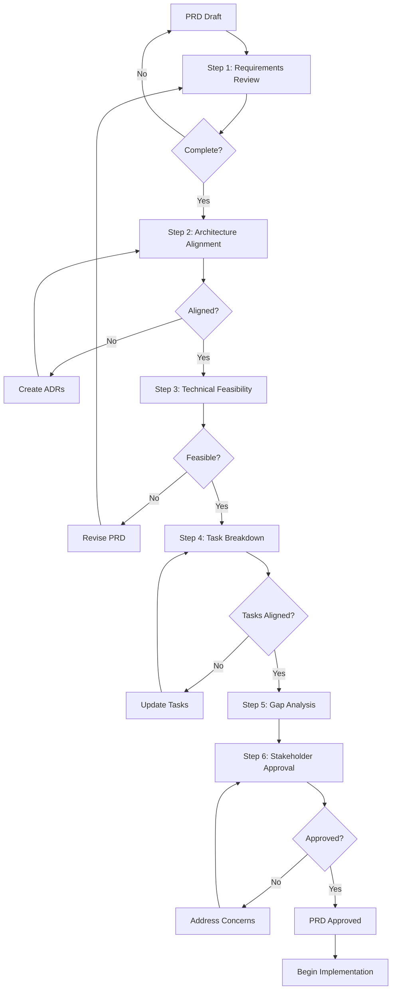

# PRD Validation Process
**Document Type:** Process Guide  
**Version:** 1.0  
**Date:** 2026-01-03  
**Status:** Active

---

## Overview

This document defines the Product Requirements Document (PRD) validation process for the P2P AI Agents project. The validation ensures that the PRD is complete, technically feasible, architecturally sound, and approved by all stakeholders before implementation begins.

---

## Validation Steps

### Step 1: Requirements Review

**Objective:** Ensure PRD completeness and clarity

**Activities:**
- [ ] Review all sections of PRD for completeness
- [ ] Verify all features have clear acceptance criteria
- [ ] Check that user personas are well-defined
- [ ] Validate success metrics are measurable
- [ ] Ensure non-functional requirements are specified
- [ ] Confirm dependencies are documented
- [ ] Review risks and mitigation strategies

**Deliverables:**
- Requirements review checklist (completed)
- List of clarification questions
- Identified gaps or ambiguities

**Participants:** Product Manager, Engineering Lead

**Duration:** 2-3 days

**Exit Criteria:**
- ✅ All PRD sections complete
- ✅ No major gaps identified
- ✅ Acceptance criteria clear and testable
- ✅ Dependencies documented

---

### Step 2: Architecture Alignment Check

**Objective:** Ensure PRD aligns with architectural decisions and technical constraints

**Activities:**
- [ ] Review PRD against existing architectural decisions
- [ ] Identify which features require new architectural decisions
- [ ] Create list of required ADRs (Architecture Decision Records)
- [ ] Assess technical feasibility of all features
- [ ] Validate security requirements are addressable
- [ ] Check performance targets are achievable
- [ ] Review scalability assumptions

**Deliverables:**
- Architecture alignment matrix
- List of required ADRs (arch-001 through arch-010)
- Technical feasibility assessment report
- Identified architectural risks

**Participants:** System Architect, Engineering Lead, Security Lead

**Duration:** 3-5 days

**Exit Criteria:**
- ✅ All features mapped to architectural components
- ✅ Required ADRs identified and prioritized
- ✅ Technical feasibility confirmed for P0/P1 features
- ✅ Architectural risks documented with mitigations

---

### Step 3: Technical Feasibility Assessment

**Objective:** Validate that PRD requirements are technically achievable

**Activities:**
- [ ] Evaluate technology stack choices
- [ ] Assess integration complexity
- [ ] Review performance requirements feasibility
- [ ] Validate security controls are implementable
- [ ] Check resource requirements (compute, storage, network)
- [ ] Identify technical dependencies
- [ ] Estimate implementation complexity
- [ ] Review test requirements feasibility

**Deliverables:**
- Technical feasibility report
- Technology risk assessment
- Resource requirements estimate
- Integration complexity analysis
- Recommended technical modifications

**Participants:** Technical Leads, Domain Experts, DevOps Lead

**Duration:** 3-5 days

**Exit Criteria:**
- ✅ All P0 features confirmed feasible
- ✅ P1 features assessed with risk mitigation
- ✅ Technology stack validated
- ✅ Resource requirements estimated
- ✅ Technical blockers identified and addressed

---

### Step 4: Task Breakdown Validation

**Objective:** Ensure PRD can be broken down into manageable, aligned tasks

**Activities:**
- [ ] Review current task backlog (385 tasks)
- [ ] Assess task alignment with PRD features
- [ ] Identify gaps between PRD and existing tasks
- [ ] Validate task priorities align with PRD phases
- [ ] Check task dependencies match PRD feature dependencies
- [ ] Review task granularity and clarity
- [ ] Ensure tasks reference architectural decisions
- [ ] Validate task estimates are reasonable

**Deliverables:**
- Task alignment report
- Gap analysis (missing tasks)
- Task priority recommendations
- Dependency graph
- Refined task backlog

**Participants:** Engineering Lead, Project Manager, Task Management Team

**Duration:** 2-3 days

**Exit Criteria:**
- ✅ Task backlog aligned with PRD phases
- ✅ All P0 features have corresponding tasks
- ✅ Task dependencies mapped
- ✅ Missing tasks identified and created
- ✅ Task priorities reflect PRD priorities

**Current Status:** 
- ⚠️ **CRITICAL FINDING:** Only 4.2% of tasks (15/359) align with architectural priorities
- ⚠️ 96% of tasks lack specific architectural guidance
- ⚠️ See Task Audit Report for detailed findings

---

### Step 5: Gap Analysis

**Objective:** Identify gaps between PRD vision and current state

**Activities:**
- [ ] Compare PRD requirements to current implementation
- [ ] Identify missing components and features
- [ ] Assess gaps in architectural decisions
- [ ] Review documentation gaps
- [ ] Check test coverage gaps
- [ ] Identify resource gaps (people, tools, infrastructure)
- [ ] Analyze timeline gaps
- [ ] Document technical debt

**Deliverables:**
- Comprehensive gap analysis report
- Prioritized gap closure plan
- Resource allocation recommendations
- Updated project timeline
- Risk-adjusted roadmap

**Participants:** Product Manager, Engineering Lead, All Team Leads

**Duration:** 2-3 days

**Exit Criteria:**
- ✅ All gaps documented with severity
- ✅ Gap closure plan created and prioritized
- ✅ Resource needs identified
- ✅ Timeline adjusted for gap closure
- ✅ Stakeholders informed of findings

**Key Gaps Identified:**
1. **Architectural Decisions:** 7/10 critical decisions have zero implementation tasks
2. **Documentation:** ADRs not documented (blocks implementation)
3. **Task Alignment:** 344/359 tasks lack architectural guidance
4. **Process:** No documented workflow for Step 2 architectural analysis

---

### Step 6: Stakeholder Approval

**Objective:** Obtain formal approval from all key stakeholders

**Activities:**
- [ ] Prepare stakeholder review package
- [ ] Schedule stakeholder review meetings
- [ ] Present PRD findings and validation results
- [ ] Address stakeholder questions and concerns
- [ ] Document stakeholder feedback
- [ ] Incorporate approved changes
- [ ] Obtain formal sign-off
- [ ] Communicate approval to team

**Deliverables:**
- Stakeholder review package
- Meeting notes and decisions
- Updated PRD (if changes required)
- Formal approval documentation
- Communication to team

**Participants:** Product Manager, Engineering Lead, Security Lead, Key Stakeholders

**Duration:** 3-5 days

**Exit Criteria:**
- ✅ All stakeholders have reviewed PRD
- ✅ Critical concerns addressed
- ✅ Formal approvals obtained
- ✅ Team notified of approval
- ✅ PRD status updated to "Approved"

**Required Approvals:**
- [ ] Product Manager
- [ ] Engineering Lead
- [ ] Security Lead
- [ ] System Architect
- [ ] (Optional) Executive Sponsor

---

## Validation Checklist

### PRD Completeness

- [ ] Executive Summary clearly states vision and value propositions
- [ ] All user personas documented with goals and pain points
- [ ] All features have clear requirements (Functional and Non-Functional)
- [ ] Acceptance criteria defined for all features
- [ ] Success metrics and KPIs specified
- [ ] Technical architecture documented
- [ ] Security requirements detailed
- [ ] Performance targets defined
- [ ] Dependencies and constraints identified
- [ ] Risks assessed with mitigation strategies
- [ ] Release plan and timeline established
- [ ] Documentation requirements specified

### Technical Validation

- [ ] Technology stack choices justified
- [ ] System architecture reviewed and approved
- [ ] Security architecture validated
- [ ] Performance requirements feasible
- [ ] Scalability targets achievable
- [ ] Integration points identified
- [ ] Data models defined
- [ ] API contracts specified
- [ ] Testing strategy comprehensive
- [ ] Deployment strategy defined

### Architectural Alignment

- [ ] All required ADRs identified
- [ ] Architectural decisions linked to features
- [ ] Design patterns documented
- [ ] Component interfaces defined
- [ ] Data flow diagrams created
- [ ] Security model documented
- [ ] Performance model validated
- [ ] Scalability model assessed

### Task Alignment

- [ ] Tasks align with PRD phases
- [ ] Task priorities match feature priorities
- [ ] Task dependencies reflect feature dependencies
- [ ] All P0 features have tasks
- [ ] Tasks reference architectural decisions
- [ ] Task granularity appropriate
- [ ] Task estimates reasonable
- [ ] Missing tasks identified

### Stakeholder Alignment

- [ ] Product vision clearly communicated
- [ ] User needs validated
- [ ] Business objectives aligned
- [ ] Technical feasibility confirmed
- [ ] Resource availability confirmed
- [ ] Timeline realistic
- [ ] Risks acknowledged
- [ ] Formal approvals obtained

---

## Process Flow

---

## Roles and Responsibilities

### Product Manager
- **Leads:** Steps 1, 5, 6
- **Participates:** All steps
- **Responsibilities:**
  - Overall PRD ownership
  - Stakeholder communication
  - Requirement clarification
  - Approval coordination

### Engineering Lead
- **Leads:** Step 3, 4
- **Participates:** All steps
- **Responsibilities:**
  - Technical feasibility assessment
  - Task breakdown and estimation
  - Team resource allocation
  - Implementation planning

### System Architect
- **Leads:** Step 2
- **Participates:** Steps 3, 5, 6
- **Responsibilities:**
  - Architecture alignment validation
  - ADR creation and review
  - System design decisions
  - Technical risk assessment

### Security Lead
- **Participates:** Steps 2, 3, 6
- **Responsibilities:**
  - Security requirements validation
  - Threat modeling
  - Security architecture review
  - Compliance assessment

### Team Members
- **Participates:** Steps 2, 3, 4 (as needed)
- **Responsibilities:**
  - Domain expertise input
  - Technical feasibility feedback
  - Task estimation
  - Implementation concerns

---

## Current Status (2026-01-03)

### Completed
- ✅ Step 1: Requirements Review (PRD v1.0 complete)

### In Progress
- 🔄 **Step 2: Architecture Alignment** ← **WE ARE HERE**
  - Task Audit Report completed (identified 10 required ADRs)
  - Documentation Validation Report completed
  - Next: Begin ADR creation (arch-001 through arch-010)

### Pending
- ⏳ Step 3: Technical Feasibility Assessment
- ⏳ Step 4: Task Breakdown Validation
- ⏳ Step 5: Gap Analysis
- ⏳ Step 6: Stakeholder Approval

### Critical Findings from Step 2

**From Task Audit Report:**
- Only 4.2% of implementation tasks (15/359) align with identified architectural priorities
- 7 out of 10 architectural decisions have ZERO implementation tasks
- 96% of tasks (344/359) lack specific architectural guidance

**Action Required:**
1. Complete 10 architectural decision documents (ADRs)
2. Generate specific implementation tasks from ADRs
3. Reprioritize existing task backlog
4. Establish task-architecture traceability

**Timeline Impact:**
- Estimated 2-4 weeks to complete ADRs (distributed across team)
- Must complete before major implementation work begins
- Critical for avoiding 6-12 month delay from rework

---

## Documentation Requirements

### For Each Validation Step

**Required Documents:**
1. **Step Completion Report**
   - Activities performed
   - Findings and observations
   - Issues identified
   - Recommendations
   - Exit criteria assessment

2. **Artifacts Produced**
   - Checklists completed
   - Analysis reports
   - Review feedback
   - Updated documents

3. **Decisions Made**
   - Key decisions
   - Rationale
   - Alternatives considered
   - Approvers

### Document Storage

- **Location:** `/docs/validation/`
- **Naming:** `step-X-[name]-report-YYYY-MM-DD.md`
- **Version Control:** All validation documents in Git
- **Access:** Shared with all stakeholders

---

## Success Criteria

### Process Success
- ✅ All 6 validation steps completed
- ✅ All exit criteria met for each step
- ✅ All required documents produced
- ✅ All stakeholder approvals obtained
- ✅ PRD status changed to "Approved"

### Quality Success
- ✅ PRD is complete, clear, and testable
- ✅ Technical feasibility confirmed
- ✅ Architectural alignment achieved
- ✅ Tasks aligned with PRD priorities
- ✅ Gaps identified and closure plan created
- ✅ Risks documented with mitigations

### Timeline Success
- 🎯 **Target:** Complete validation in 2-3 weeks
- 🎯 **Current:** In Step 2 (Architecture Alignment)
- 🎯 **Critical Path:** ADR creation (2-4 weeks)
- 🎯 **Total:** 4-7 weeks for complete validation

---

## Next Steps

### Immediate (This Week)
1. ✅ Create ADR infrastructure (directory, template)
2. ✅ Document PRD validation process (this document)
3. ⏳ Distribute ADR work (arch-001 through arch-010)
4. ⏳ Schedule weekly design review sessions

### Short-Term (Weeks 2-4)
5. ⏳ Complete all 10 ADRs
6. ⏳ Conduct design reviews
7. ⏳ Generate implementation tasks from ADRs
8. ⏳ Complete Step 3: Technical Feasibility

### Medium-Term (Weeks 5-7)
9. ⏳ Complete Step 4: Task Breakdown Validation
10. ⏳ Complete Step 5: Gap Analysis
11. ⏳ Complete Step 6: Stakeholder Approval
12. ⏳ Begin aligned implementation

---

## References

- [PRD.md](PRD.md) - Product Requirements Document
- [high-level-design.md](high-level-design.md) - System Architecture
- [Task Audit Report](../tasks/TASK_AUDIT_REPORT.md) - Task alignment findings
- [Documentation Validation Report](DOC_VALIDATION_REPORT.md) - Documentation gaps
- [Task Management Guide](development/task-management.md) - Task workflow

---

*This is a living document. Update as the validation process evolves.*  
*Last Updated: 2026-01-03*
