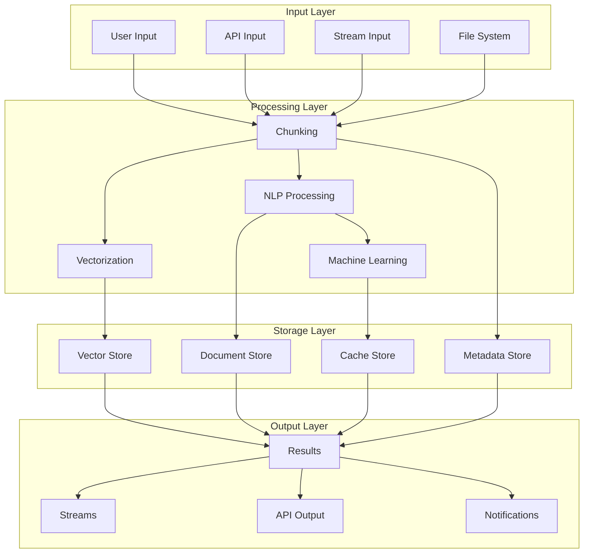
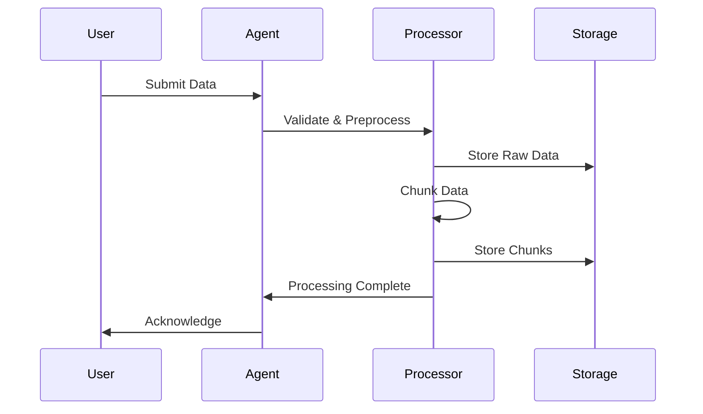
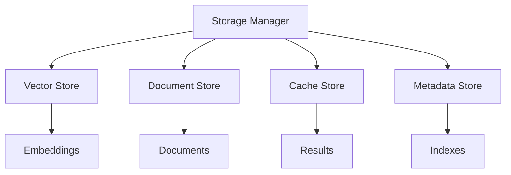
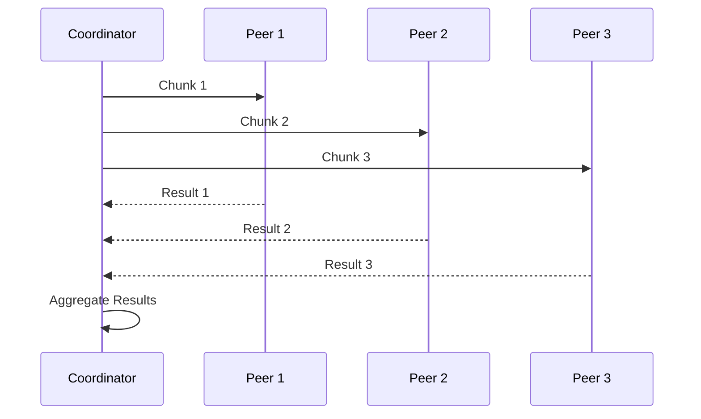

# Data Flow Architecture

## Data Flow Model

The P2P AI Agents system implements a distributed data flow model with the following characteristics:

### 1. Data Principles
- Data sovereignty
- Privacy preservation
- Efficient processing
- Secure transmission

### 2. Flow Properties
- Asynchronous processing
- Parallel execution
- Fault tolerance
- Data consistency

### 3. Processing Types
- Stream processing
- Batch processing
- Real-time processing
- Hybrid processing

## Data Flow Architecture

## Data Processing Flow

### 1. Input Processing

#### Data Ingestion

#### Input Types
- Text documents
- Stream data
- API requests
- File uploads

### 2. Processing Pipeline

#### Chunking Process
1. Input validation
2. Size optimization
3. Overlap calculation
4. Chunk generation
5. Metadata extraction

#### Processing Steps
- Text normalization
- Feature extraction
- Vector generation
- Model inference
- Result aggregation

### 3. Storage Management

#### Storage Types

#### Storage Policies
- Data retention
- Replication
- Backup
- Cleanup

## Data Communication

### 1. Message Flow

#### Task Distribution

#### Result Aggregation
- Result collection
- Validation
- Merging
- Finalization

### 2. Data Transfer

#### Transfer Protocols
- Direct transfer
- Chunked transfer
- Stream transfer
- Batch transfer

#### Optimization
- Compression
- Deduplication
- Caching
- Prioritization

## Data Security

### 1. Data Protection

#### Encryption
- At rest
- In transit
- In use
- End-to-end

#### Access Control
- Authentication
- Authorization
- Audit logging
- Data masking

### 2. Privacy Measures

#### Privacy Techniques
- Differential privacy
- Homomorphic encryption
- Secure multi-party computation
- Zero-knowledge proofs

#### Data Minimization
- Purpose limitation
- Data retention
- Access control
- Deletion policies

## Data Consistency

### 1. Consistency Models

#### Types
- Eventual consistency
- Strong consistency
- Causal consistency
- Sequential consistency

#### Implementation
- Version control
- Conflict resolution
- State synchronization
- Consensus protocols

### 2. Data Validation

#### Validation Types
- Schema validation
- Content validation
- Integrity checks
- Consistency verification

#### Validation Process
1. Input validation
2. Processing validation
3. Output validation
4. Storage validation

## Performance Optimization

### 1. Processing Optimization

#### Techniques
- Parallel processing
- Batch processing
- Stream processing
- Caching

#### Resource Management
- Load balancing
- Resource allocation
- Priority queuing
- Throttling

### 2. Storage Optimization

#### Strategies
- Data compression
- Indexing
- Caching
- Archiving

#### Performance Tuning
- Query optimization
- Storage layout
- Cache management
- I/O optimization

## Monitoring and Metrics

### 1. Data Metrics

#### Processing Metrics
- Throughput
- Latency
- Error rates
- Resource usage

#### Storage Metrics
- Capacity
- Utilization
- Performance
- Health

### 2. Monitoring Tools

#### Processing Monitoring
- Task tracking
- Resource monitoring
- Error tracking
- Performance profiling

#### Storage Monitoring
- Capacity planning
- Performance analysis
- Health checks
- Backup monitoring

## Error Handling

### 1. Error Types

#### Processing Errors
- Input errors
- Processing failures
- Resource exhaustion
- Timeout errors

#### Storage Errors
- Write failures
- Read errors
- Consistency errors
- Capacity errors

### 2. Recovery Strategies

#### Recovery Methods
- Retry logic
- Fallback processing
- Data recovery
- State restoration

#### Error Prevention
- Input validation
- Resource monitoring
- Error detection
- Proactive measures

## Future Considerations

### 1. Planned Improvements
- Advanced processing
- Enhanced security
- Better scalability
- Improved performance

### 2. Research Areas
- Novel processing methods
- Privacy enhancements
- Performance optimization
- New use cases

---

*Note: This document outlines the data flow architecture. For implementation details, see the [Data Flow Implementation Guide](data-flow-implementation.md).*

*Last updated: [Current Date]* 