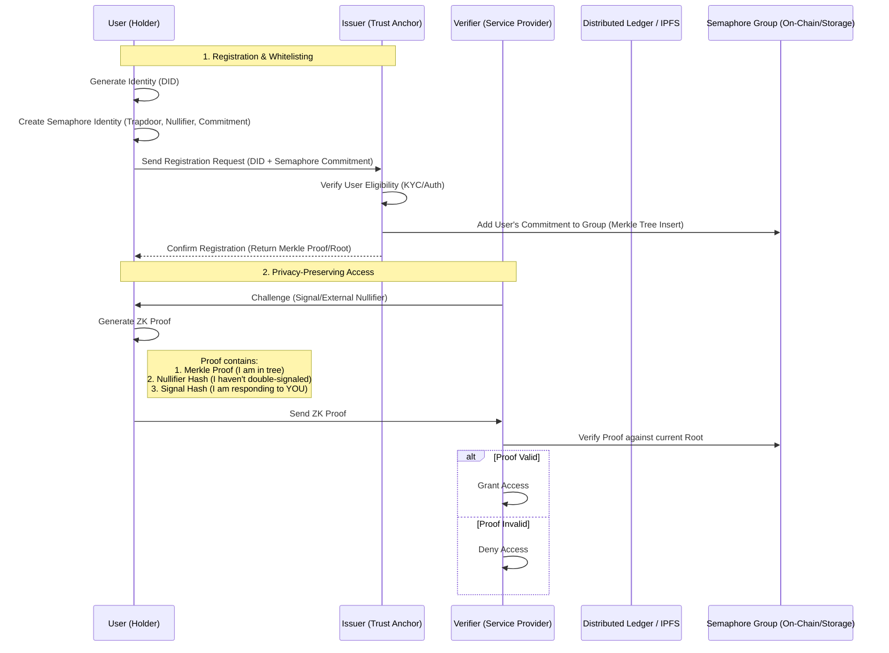

# Distributed Identity & Trust System Design

## 1. Architecture Overview

This document outlines the architecture for a **distributed identity system** that enables privacy-preserving whitelisting and trust management.

The system combines:
*   **IOTA Identity**: For standard W3C Decentralized Identifiers (DIDs) and Verifiable Credentials (VCs).
*   **Semaphore**: For Zero-Knowledge (ZK) set membership, allowing users to prove "I am in this group" without revealing "I am User X".

### High-Level Interaction Flow



## 2. Component Architecture

The system is composed of three main Rust crates/modules:

### 2.1. `identity-core` (The Identity Wrapper)
Wraps `iotaledger/identity` to manage the lifecycle of DIDs.

*   **Responsibilities**:
    *   Create and manage DID Documents.
    *   Sign and verify standard messages.
    *   Interact with the IOTA Tangle (or local storage during testing).

```rust
// Draft Rust Structure
pub struct IdentityManager {
    // IOTA Identity storage/stronghold
    storage: Storage,
    // The active DID
    did: IotaDID,
}
```

### 2.2. `trust-registry` (The Whitelist Manager)
Wraps `semaphore-rs` to manage group membership.

*   **Responsibilities**:
    *   Maintain the Merkle Tree of valid members.
    *   Handle "Insert" operations (Whitelisting).
    *   Generate ZK Proofs for members.
    *   Verify ZK Proofs for verifiers.

```rust
// Draft Rust Structure
use semaphore::protocol::{Identity, Group, generate_proof, verify_proof};

pub struct TrustRegistry {
    // The Semaphore Group (Merkle Tree)
    group: Group,
    // Map of active roots to handle concurrency/latency
    valid_roots: Vec<Field>,
}

pub struct UserCredential {
    // The private Semaphore Identity (kept by user)
    identity: Identity,
    // The last known Merkle Proof
    proof: MerkleProof,
}
```

### 2.3. `p2p-protocol` (The Network Layer)
Defines how these proofs are exchanged over the wire (libp2p).

*   **Responsibilities**:
    *   Define the `RegistrationRequest` struct (DID + Commitment).
    *   Define the `AuthenticationResponse` struct (ZK Proof).

## 3. Testing Strategy (Distributed Simulation)

Since no off-the-shelf framework exists for this specific stack, we will build a simulation harness using `tokio`.

### Simulation Harness Design

We will create a binary `simulation_runner` that spawns:

1.  **Trust Anchor Node**: Acts as the `Issuer`. Initializes a Semaphore Group.
2.  **User Agents (N)**: Generate DIDs and Semaphore Identities. They register with the Trust Anchor.
3.  **Verifier Node**: Receives proofs from User Agents and validates them against the Trust Anchor's public state (the Merkle Root).

### Test Flow (`tokio::test`)

1.  **Setup**:
    *   `Issuer` starts, creates `Group ID 1`.
    *   `User A` starts, generates `Identity A`.
2.  **Registration**:
    *   `User A` sends `Commitment A` to `Issuer`.
    *   `Issuer` adds `Commitment A` to `Group 1`.
    *   `Issuer` broadcasts new `Merkle Root`.
3.  **Verification**:
    *   `Verifier` gets challenge "Login Request".
    *   `User A` generates ZK Proof for "Login Request" using `Identity A` + `Merkle Proof`.
    *   `Verifier` checks Proof. **Success**.
4.  **Privacy Check**:
    *   `Verifier` asserts that they cannot derive `Identity A` from the Proof.
5.  **Sybil Resistance Check**:
    *   `User A` tries to generate a *second* proof for the same "Login Request".
    *   `Verifier` detects duplicate `Nullifier Hash`. **Reject**.

## 4. Next Steps

1.  Create `src/core/identity/` module.
2.  Implement `IdentityManager` using `iotaledger/identity`.
3.  Implement `TrustRegistry` using `semaphore-rs`.
4.  Write the `simulation_runner` integration test.
