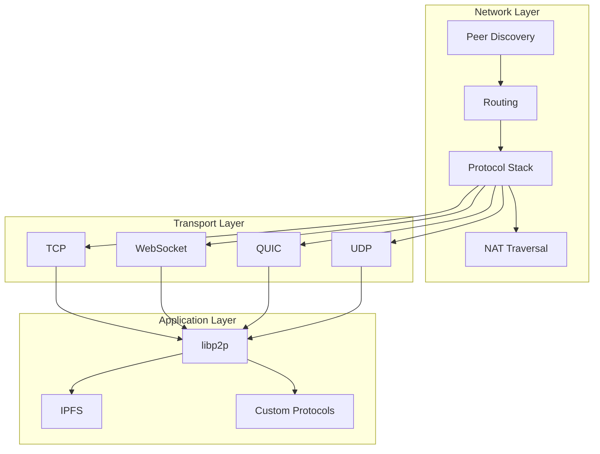
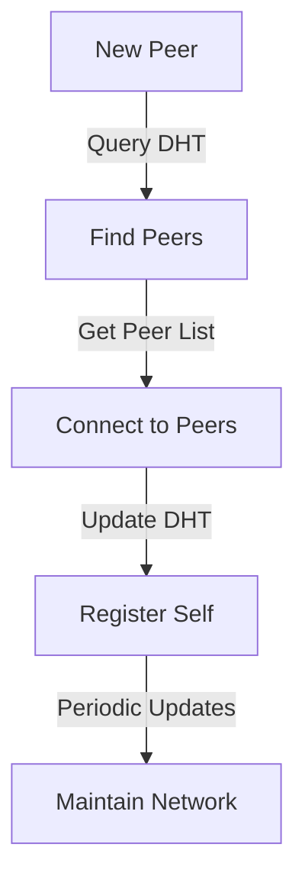
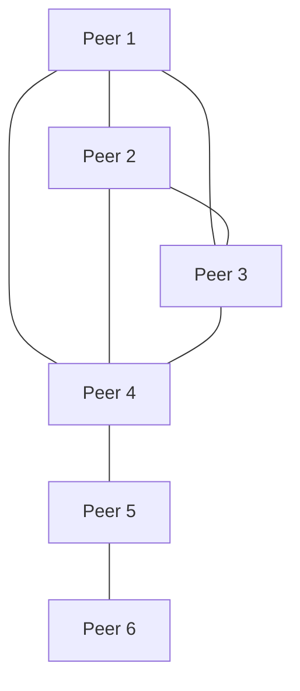
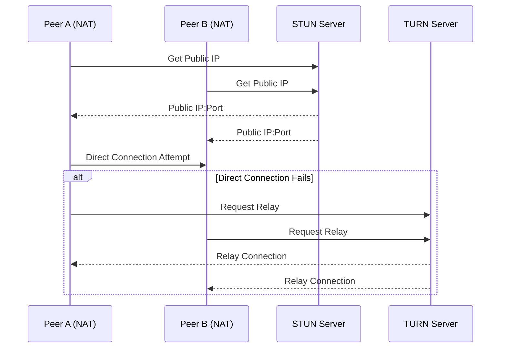

# Networking Architecture

## Network Model

The P2P AI Agents system implements a decentralized networking model with the following characteristics:

### 1. Peer-to-Peer Topology
- Fully distributed network
- No central coordination
- Dynamic peer connections
- Self-organizing structure

### 2. Network Properties
- Scalable to thousands of peers
- Resilient to node failures
- Low latency communication
- Efficient resource utilization

### 3. Network Types
- Local network (LAN)
- Internet-wide network
- Hybrid networks
- Private networks

## Network Architecture

## Protocol Stack

### 1. Application Layer

#### libp2p Integration
- Modular network stack
- Protocol multiplexing
- Peer discovery
- Content routing

#### Custom Protocols
- Task distribution
- Result aggregation
- Resource management
- Peer coordination

### 2. Transport Layer

#### TCP
- Reliable delivery
- Connection-oriented
- Flow control
- Congestion control

#### WebSocket
- Full-duplex communication
- Browser compatibility
- Proxy support
- Real-time updates

#### QUIC
- Connection multiplexing
- 0-RTT handshake
- Forward error correction
- Connection migration

#### UDP
- Low-latency communication
- Connectionless
- Broadcast support
- Custom reliability

## Peer Discovery

### 1. Discovery Mechanisms

#### DHT-based Discovery

#### Bootstrap Process
1. Connect to bootstrap nodes
2. Query DHT for peers
3. Establish connections
4. Register in network
5. Start peer discovery

### 2. Peer Management

#### Peer Types
- Bootstrap peers
- Regular peers
- Super peers
- Gateway peers

#### Connection Management
- Connection limits
- Quality metrics
- Failure detection
- Reconnection logic

## Network Topology

### 1. Topology Types

#### Mesh Network

#### Hybrid Network
- Mesh for local peers
- Super peers for routing
- Gateway peers for external access
- Bootstrap nodes for discovery

### 2. Network Organization

#### Geographic Distribution
- Regional clusters
- Cross-region connections
- Latency optimization
- Load distribution

#### Resource-based Organization
- Compute capacity
- Storage capacity
- Network capacity
- Specialized capabilities

## Message Routing

### 1. Routing Strategies

#### Direct Routing
- Peer-to-peer messages
- Shortest path
- Quality-based selection
- Load balancing

#### DHT Routing
- Content-based routing
- Distributed lookup
- Caching
- Replication

### 2. Message Types

#### Control Messages
- Peer discovery
- Connection management
- Health checks
- Resource updates

#### Data Messages
- Task distribution
- Result sharing
- Resource allocation
- State synchronization

## NAT Traversal

### 1. Traversal Techniques

#### STUN/TURN
- NAT type detection
- Connection establishment
- Relay fallback
- Session management

#### UPnP
- Port forwarding
- Automatic configuration
- Router compatibility
- Security considerations

### 2. Connection Establishment

## Network Security

### 1. Transport Security

#### Encryption
- TLS 1.3
- Perfect forward secrecy
- Certificate pinning
- Custom encryption

#### Authentication
- Peer identity
- Message signing
- Challenge-response
- Session management

### 2. Network Protection

#### DDoS Mitigation
- Rate limiting
- Connection filtering
- Resource quotas
- Traffic shaping

#### Sybil Protection
- Identity verification
- Resource commitment
- Reputation system
- Peer validation

## Performance Optimization

### 1. Network Optimization

#### Connection Management
- Connection pooling
- Keep-alive
- Timeout handling
- Error recovery

#### Message Optimization
- Message batching
- Compression
- Caching
- Prioritization

### 2. Resource Management

#### Bandwidth Control
- Traffic shaping
- Quality of service
- Priority queuing
- Rate limiting

#### Resource Allocation
- Dynamic allocation
- Load balancing
- Resource reservation
- Usage monitoring

## Monitoring and Metrics

### 1. Network Metrics

#### Performance Metrics
- Latency
- Throughput
- Packet loss
- Connection quality

#### Health Metrics
- Peer count
- Connection status
- Error rates
- Resource usage

### 2. Monitoring Tools

#### Network Monitoring
- Peer discovery
- Connection tracking
- Traffic analysis
- Performance profiling

#### Diagnostic Tools
- Network testing
- Connection debugging
- Protocol analysis
- Performance testing

## Future Considerations

### 1. Planned Improvements
- Advanced routing protocols
- Better NAT traversal
- Enhanced security
- Performance optimization

### 2. Research Areas
- Novel P2P protocols
- Network optimization
- Security enhancements
- Scalability improvements

---

*Note: This document outlines the networking architecture. For implementation details, see the [Networking Implementation Guide](networking-implementation.md).*

*Last updated: [Current Date]* 