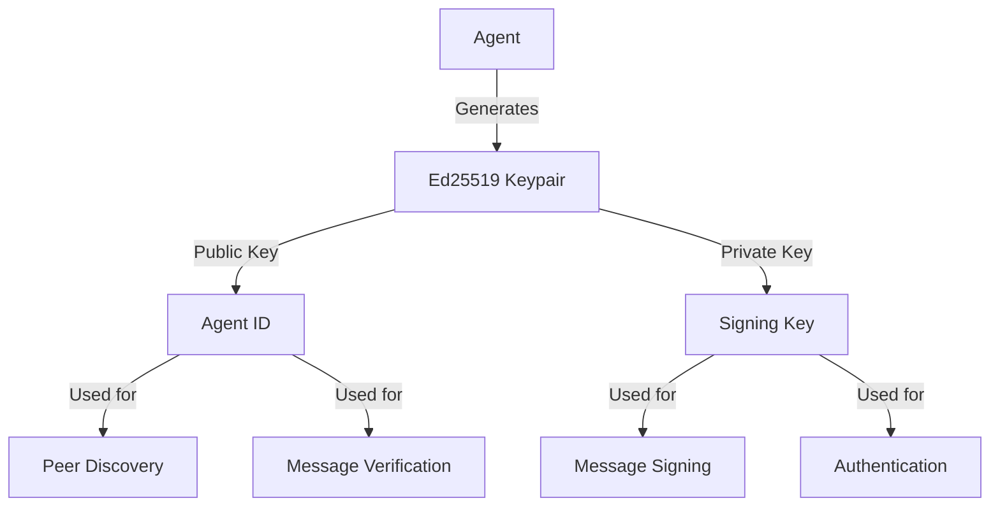
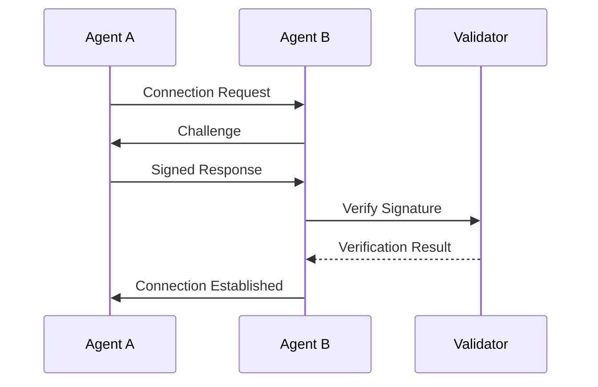
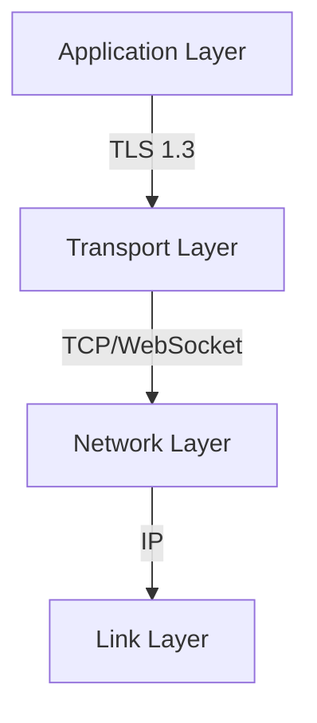
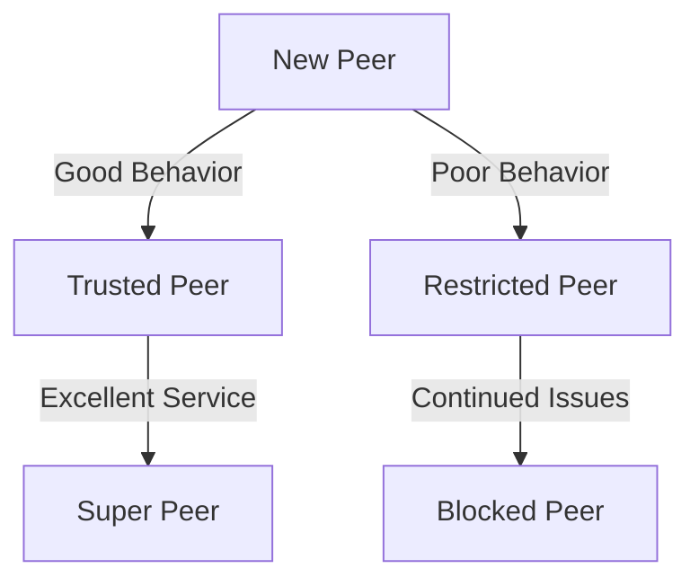

# Security Architecture

## Security Model

The P2P AI Agents system implements a comprehensive security model based on the following principles:

### 1. Zero Trust
- No implicit trust between agents
- Continuous verification
- Least privilege access
- Defense in depth

### 2. Privacy by Design
- Data minimization
- End-to-end encryption
- Privacy-preserving computation
- Secure data deletion

### 3. Cryptographic Security
- Strong encryption
- Secure key management
- Digital signatures
- Perfect forward secrecy

## Authentication & Identity

### 1. Agent Identity

#### Cryptographic Identity


#### Identity Management
- Each agent generates a unique Ed25519 keypair
- Public key serves as permanent agent identifier
- Private key stored securely with access controls
- Key rotation and backup mechanisms

### 2. Authentication Flow



#### Authentication Steps
1. Initial connection request
2. Challenge-response protocol
3. Signature verification
4. Session establishment
5. Periodic re-authentication

## Communication Security

### 1. Transport Layer Security

#### Protocol Stack


#### Security Features
- TLS 1.3 for all communications
- Perfect forward secrecy
- Certificate pinning
- Strong cipher suites

### 2. Message Security

#### Message Format
```json
{
  "header": {
    "version": "1.0",
    "timestamp": 1640995200,
    "sender_id": "ed25519:public_key",
    "recipient_id": "ed25519:public_key",
    "message_type": "task_request"
  },
  "payload": {
    "encrypted": true,
    "cipher": "aes-256-gcm",
    "data": "encrypted_data",
    "nonce": "random_nonce"
  },
  "signature": "ed25519_signature"
}
```

#### Security Measures
- Message signing with Ed25519
- Payload encryption with AES-256-GCM
- Nonce-based replay protection
- Timestamp validation

## Access Control

### 1. Role-Based Access Control (RBAC)

#### Roles
- System Administrator
- Agent Operator
- Task Submitter
- Peer Node
- Gateway Service

#### Permissions
```yaml
roles:
  system_admin:
    - manage_agents
    - manage_network
    - manage_security
    - view_metrics
  
  agent_operator:
    - submit_tasks
    - view_status
    - manage_local_agent
    
  task_submitter:
    - submit_tasks
    - view_results
    
  peer_node:
    - process_tasks
    - share_results
    - discover_peers
    
  gateway_service:
    - api_access
    - rate_limiting
    - protocol_translation
```

### 2. Resource Access Control

#### Resource Types
- Compute resources
- Storage resources
- Network resources
- API endpoints

#### Access Policies
- Resource quotas
- Rate limiting
- Time-based restrictions
- Geographic restrictions

## Trust Mechanisms

### 1. Reputation System

#### Reputation Factors
- Task completion rate
- Response time
- Resource contribution
- Error rate
- Peer feedback

#### Trust Levels


### 2. Consensus Mechanisms

#### Types
- Proof of Work
- Proof of Stake
- Reputation-based
- Hybrid approaches

#### Implementation
- Task validation
- Result verification
- Peer voting
- Reputation weighting

## Security Monitoring

### 1. Monitoring Systems

#### Metrics
- Authentication attempts
- Failed operations
- Resource usage
- Network traffic
- Error rates

#### Alerts
- Security violations
- Resource exhaustion
- Suspicious behavior
- System anomalies

### 2. Audit Logging

#### Log Types
- Security events
- Access attempts
- Configuration changes
- System operations

#### Log Management
- Secure storage
- Retention policies
- Access controls
- Analysis tools

## Security Best Practices

### 1. For Users
- Regular key rotation
- Strong authentication
- Secure configuration
- Regular updates

### 2. For Developers
- Secure coding practices
- Security testing
- Dependency management
- Code review

### 3. For Operators
- Monitoring
- Incident response
- Backup procedures
- Update management

## Incident Response

### 1. Response Plan
1. Detection
2. Analysis
3. Containment
4. Eradication
5. Recovery
6. Lessons learned

### 2. Security Contacts
- Security team
- Incident response team
- External security advisors
- Law enforcement (if needed)

## Compliance

### 1. Standards
- GDPR compliance
- Data protection
- Privacy requirements
- Security standards

### 2. Certifications
- Security audits
- Penetration testing
- Compliance reviews
- Third-party assessments

---

*Note: This document outlines the security architecture. For implementation details, see the [Security Implementation Guide](security-implementation.md).*

*Last updated: [Current Date]* 