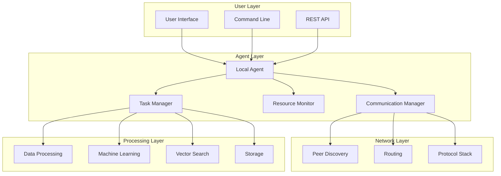
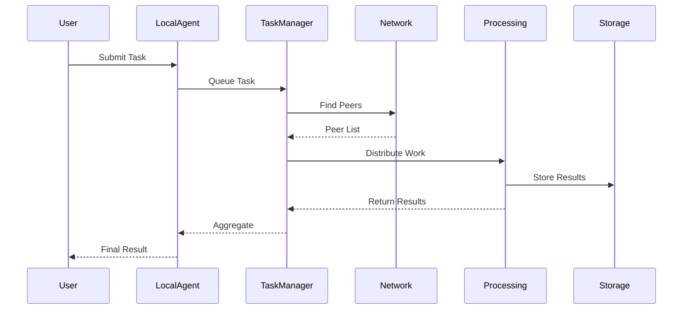

# System Overview

## Architecture Principles

The P2P AI Agents system is built on the following core principles:

### 1. Decentralization
- No single point of failure
- Distributed decision-making
- Peer-to-peer communication
- Autonomous agent operation

### 2. Privacy-First
- Data sovereignty
- End-to-end encryption
- Zero-knowledge processing
- Privacy-preserving computations

### 3. Energy Efficiency
- Resource optimization
- Smart scheduling
- Renewable energy awareness
- Efficient task distribution

### 4. Scalability
- Horizontal scaling
- Dynamic peer discovery
- Load balancing
- Resource-aware routing

### 5. Interoperability
- Standard protocols
- API compatibility
- Multi-platform support
- Extensible architecture

### 6. Security
- Cryptographic identity
- Secure communication
- Trust mechanisms
- Access control

## System Architecture

## Core Components

### 1. Agent Core
The central orchestrator managing local operations and peer communications.

#### Components:
- **Task Manager**: Handles task queuing, distribution, and execution
- **Resource Monitor**: Tracks CPU, memory, storage, and network usage
- **Communication Manager**: Manages P2P networking and messaging
- **Identity Manager**: Handles cryptographic identity and authentication

### 2. Specialized Agents

#### Processing Agents
- Handle data chunking and transformation
- Execute NLP tasks
- Manage data pipelines
- Optimize for CPU-intensive workloads

#### Vector Agents
- Generate embeddings
- Perform similarity search
- Manage vector databases
- Support GPU acceleration

#### Storage Agents
- Provide distributed storage
- Handle data redundancy
- Manage data lifecycle
- Implement consistency protocols

#### Coordinator Agents
- Orchestrate complex workflows
- Manage task dependencies
- Aggregate results
- Handle consensus

#### Gateway Agents
- Bridge to external services
- Provide API endpoints
- Handle protocol translation
- Manage rate limiting

### 3. Network Layer

#### Peer Discovery
- DHT-based peer discovery
- Bootstrap node integration
- NAT traversal
- Connection management

#### Routing
- Task routing
- Load balancing
- Geographic optimization
- Failover handling

#### Protocol Stack
- libp2p integration
- WebSocket support
- Custom protocols
- Protocol negotiation

### 4. Processing Layer

#### Data Processing
- Text chunking
- Document processing
- Data transformation
- Stream processing

#### Machine Learning
- Model distribution
- Federated learning
- Inference optimization
- Model versioning

#### Vector Operations
- Embedding generation
- Similarity search
- Vector indexing
- Query optimization

#### Storage
- Distributed storage
- Data redundancy
- Consistency protocols
- Cache management

## Data Flow

## System Interactions

### 1. Task Processing Flow
1. User submits task
2. Local agent validates and queues
3. Task manager distributes work
4. Peers process subtasks
5. Results are aggregated
6. User receives response

### 2. Peer Communication
1. Peer discovery
2. Connection establishment
3. Protocol negotiation
4. Secure communication
5. Task distribution
6. Result sharing

### 3. Resource Management
1. Resource monitoring
2. Load balancing
3. Task scheduling
4. Energy optimization
5. Performance tracking

## Design Considerations

### 1. Performance
- Task parallelization
- Resource optimization
- Network efficiency
- Cache utilization

### 2. Reliability
- Fault tolerance
- Error recovery
- State management
- Consistency protocols

### 3. Security
- Authentication
- Authorization
- Encryption
- Trust mechanisms

### 4. Scalability
- Horizontal scaling
- Load distribution
- Resource management
- Network optimization

## Implementation Guidelines

### 1. Code Organization
- Modular architecture
- Clear interfaces
- Separation of concerns
- Plugin system

### 2. Testing Strategy
- Unit testing
- Integration testing
- Performance testing
- Security testing

### 3. Documentation
- API documentation
- Architecture diagrams
- Code comments
- Usage examples

### 4. Monitoring
- Performance metrics
- Resource usage
- Error tracking
- Health checks

## Future Considerations

### 1. Planned Improvements
- Advanced consensus mechanisms
- Enhanced privacy features
- Improved scalability
- Better resource management

### 2. Research Areas
- Novel P2P protocols
- Privacy-preserving ML
- Energy optimization
- Trust mechanisms

### 3. Integration Opportunities
- Blockchain systems
- Cloud services
- IoT devices
- Edge computing

---

*Note: This document provides a high-level overview. For detailed specifications, see the individual component documentation.*

*Last updated: [Current Date]* 