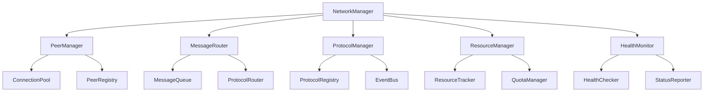

# Network Manager Implementation

## Version Information
- Current Version: 0.1.0
- Last Updated: 2025-06-14
- Status: In Development
- Minimum Rust Version: 1.75.0
- Dependencies:
  - libp2p = "0.53.0"
  - tokio = { version = "1.36.0", features = ["full"] }
  - async-trait = "0.1.77"
  - futures = "0.3.30"
  - tracing = "0.1.40"

## Table of Contents
1. [Overview](#overview)
2. [Network Manager Structure](#network-manager-structure)
3. [Initialization and Setup](#initialization-and-setup)
4. [Peer Management](#peer-management)
5. [Message Routing](#message-routing)
6. [Event Processing](#event-processing)
7. [Resource Management](#resource-management)
8. [Health Monitoring](#health-monitoring)
9. [Error Handling](#error-handling)
10. [Performance Optimization](#performance-optimization)
11. [Security Implementation](#security-implementation)
12. [Testing](#testing)

## Overview
The Network Manager is the core component responsible for managing peer-to-peer network operations. It handles peer connections, message routing, protocol management, and event processing in a distributed system.

### Key Features
1. **Peer Management**
   - Peer discovery and connection
   - Connection state management
   - Peer reputation tracking
   - Connection health monitoring
   - Peer capability negotiation

2. **Message Routing**
   - Reliable message delivery
   - Message prioritization
   - Protocol-based routing
   - Message validation
   - Error handling

3. **Protocol Management**
   - Protocol registration
   - Protocol state management
   - Protocol event handling
   - Protocol versioning
   - Protocol security

4. **Resource Management**
   - Connection limits
   - Bandwidth control
   - Memory management
   - Resource monitoring
   - Resource allocation

### Architecture


## Network Manager Structure

### Core Components
```rust
use libp2p::{
    core::{multiaddr::Multiaddr, PeerId},
    identity::{Keypair, PublicKey},
    swarm::{NetworkBehaviour, Swarm, SwarmEvent},
    Transport,
};
use tokio::sync::{mpsc, RwLock};
use std::collections::{HashMap, HashSet};
use std::sync::Arc;
use std::time::Duration;

/// Network manager for P2P system
///
/// This type manages all network operations, including peer connections,
/// message routing, protocol management, and event processing.
///
/// # Examples
/// ```
/// use p2p_ai_agents::network::NetworkManager;
///
/// let manager = NetworkManager::new(NetworkConfig::default()).await?;
/// manager.start().await?;
/// ```
#[derive(Debug)]
pub struct NetworkManager {
    /// Network configuration
    config: NetworkConfig,
    
    /// Local peer identity
    local_peer: PeerInfo,
    
    /// Connected peers
    peers: Arc<RwLock<HashMap<PeerId, PeerInfo>>>,
    
    /// Network swarm
    swarm: Swarm<NetworkBehaviour>,
    
    /// Event channels
    events: EventChannels,
    
    /// Metrics collector
    metrics: Arc<MetricsCollector>,
    
    /// Resource manager
    resources: Arc<ResourceManager>,
    
    /// Health monitor
    health: Arc<HealthMonitor>,
    
    /// Security manager
    security: Arc<SecurityManager>,
}

/// Event channels for network manager
///
/// This type manages the event channels used for internal communication
/// between different components of the network manager.
///
/// # Examples
/// ```
/// use p2p_ai_agents::network::EventChannels;
///
/// let channels = EventChannels::new();
/// channels.peer_events.send(PeerEvent::Connected(peer_id)).await?;
/// ```
#[derive(Debug)]
pub struct EventChannels {
    /// Peer events channel
    pub peer_events: mpsc::Sender<PeerEvent>,
    
    /// Protocol events channel
    pub protocol_events: mpsc::Sender<ProtocolEvent>,
    
    /// Resource events channel
    pub resource_events: mpsc::Sender<ResourceEvent>,
    
    /// Health events channel
    pub health_events: mpsc::Sender<HealthEvent>,
    
    /// System events channel
    pub system_events: mpsc::Sender<SystemEvent>,
}

/// Network manager builder
///
/// This type provides a builder pattern for creating and configuring
/// a network manager instance.
///
/// # Examples
/// ```
/// use p2p_ai_agents::network::NetworkManagerBuilder;
///
/// let manager = NetworkManagerBuilder::new()
///     .with_config(NetworkConfig::default())
///     .with_metrics(MetricsCollector::new())
///     .with_security(SecurityConfig::default())
///     .build()
///     .await?;
/// ```
#[derive(Debug, Default)]
pub struct NetworkManagerBuilder {
    /// Network configuration
    config: Option<NetworkConfig>,
    
    /// Metrics collector
    metrics: Option<MetricsCollector>,
    
    /// Security configuration
    security: Option<SecurityConfig>,
    
    /// Resource configuration
    resources: Option<ResourceConfig>,
    
    /// Health configuration
    health: Option<HealthConfig>,
}

## Initialization and Setup

### Network Manager Creation
```rust
impl NetworkManager {
    /// Create a new network manager
    ///
    /// This function creates a new network manager instance with the
    /// specified configuration.
    ///
    /// # Arguments
    /// * `config` - Network configuration
    ///
    /// # Returns
    /// A new network manager instance
    ///
    /// # Errors
    /// Returns an error if the network manager cannot be created
    ///
    /// # Examples
    /// ```
    /// use p2p_ai_agents::network::NetworkManager;
    ///
    /// let manager = NetworkManager::new(NetworkConfig::default()).await?;
    /// ```
    pub async fn new(config: NetworkConfig) -> Result<Self, NetworkError> {
        // Generate local peer identity
        let local_peer = Self::generate_local_peer(&config)?;
        
        // Create event channels
        let events = EventChannels::new();
        
        // Create metrics collector
        let metrics = Arc::new(MetricsCollector::new());
        
        // Create resource manager
        let resources = Arc::new(ResourceManager::new(config.resource_limits.clone())?);
        
        // Create health monitor
        let health = Arc::new(HealthMonitor::new(config.health_config.clone())?);
        
        // Create security manager
        let security = Arc::new(SecurityManager::new(config.security_config.clone())?);
        
        // Create network swarm
        let swarm = Self::create_network_swarm(
            &config,
            &local_peer,
            &events,
            &metrics,
            &resources,
            &health,
            &security,
        ).await?;
        
        Ok(Self {
            config,
            local_peer,
            peers: Arc::new(RwLock::new(HashMap::new())),
            swarm,
            events,
            metrics,
            resources,
            health,
            security,
        })
    }
    
    /// Start the network manager
    ///
    /// This function starts the network manager and begins processing
    /// network events.
    ///
    /// # Returns
    /// A future that completes when the network manager is stopped
    ///
    /// # Errors
    /// Returns an error if the network manager cannot be started
    ///
    /// # Examples
    /// ```
    /// use p2p_ai_agents::network::NetworkManager;
    ///
    /// let manager = NetworkManager::new(NetworkConfig::default()).await?;
    /// manager.start().await?;
    /// ```
    pub async fn start(&mut self) -> Result<(), NetworkError> {
        // Start event processing
        self.start_event_processing().await?;
        
        // Start resource monitoring
        self.resources.start_monitoring().await?;
        
        // Start health monitoring
        self.health.start_monitoring().await?;
        
        // Start security monitoring
        self.security.start_monitoring().await?;
        
        // Bootstrap the network
        self.bootstrap().await?;
        
        // Start the swarm
        self.start_swarm().await?;
        
        Ok(())
    }
    
    /// Create network swarm
    ///
    /// This function creates a new network swarm with the specified
    /// configuration and components.
    ///
    /// # Arguments
    /// * `config` - Network configuration
    /// * `local_peer` - Local peer information
    /// * `events` - Event channels
    /// * `metrics` - Metrics collector
    /// * `resources` - Resource manager
    /// * `health` - Health monitor
    /// * `security` - Security manager
    ///
    /// # Returns
    /// A new network swarm
    ///
    /// # Errors
    /// Returns an error if the swarm cannot be created
    async fn create_network_swarm(
        config: &NetworkConfig,
        local_peer: &PeerInfo,
        events: &EventChannels,
        metrics: &Arc<MetricsCollector>,
        resources: &Arc<ResourceManager>,
        health: &Arc<HealthMonitor>,
        security: &Arc<SecurityManager>,
    ) -> Result<Swarm<NetworkBehaviour>, NetworkError> {
        // Create transport
        let transport = Self::create_transport(config, security).await?;
        
        // Create network behaviour
        let behaviour = Self::create_network_behaviour(
            config,
            local_peer,
            events,
            metrics,
            resources,
            health,
            security,
        ).await?;
        
        // Create swarm
        let swarm = Swarm::new(transport, behaviour, local_peer.peer_id);
        
        Ok(swarm)
    }
}

### Network Manager Builder
```rust
impl NetworkManagerBuilder {
    /// Create a new network manager builder
    ///
    /// This function creates a new network manager builder instance.
    ///
    /// # Returns
    /// A new network manager builder
    ///
    /// # Examples
    /// ```
    /// use p2p_ai_agents::network::NetworkManagerBuilder;
    ///
    /// let builder = NetworkManagerBuilder::new();
    /// ```
    pub fn new() -> Self {
        Self::default()
    }
    
    /// Set network configuration
    ///
    /// This function sets the network configuration for the builder.
    ///
    /// # Arguments
    /// * `config` - Network configuration
    ///
    /// # Returns
    /// The builder instance
    ///
    /// # Examples
    /// ```
    /// use p2p_ai_agents::network::NetworkManagerBuilder;
    ///
    /// let builder = NetworkManagerBuilder::new()
    ///     .with_config(NetworkConfig::default());
    /// ```
    pub fn with_config(mut self, config: NetworkConfig) -> Self {
        self.config = Some(config);
        self
    }
    
    /// Build network manager
    ///
    /// This function builds a new network manager instance with the
    /// configured settings.
    ///
    /// # Returns
    /// A new network manager instance
    ///
    /// # Errors
    /// Returns an error if the network manager cannot be created
    ///
    /// # Examples
    /// ```
    /// use p2p_ai_agents::network::NetworkManagerBuilder;
    ///
    /// let manager = NetworkManagerBuilder::new()
    ///     .with_config(NetworkConfig::default())
    ///     .build()
    ///     .await?;
    /// ```
    pub async fn build(self) -> Result<NetworkManager, NetworkError> {
        let config = self.config.ok_or_else(|| NetworkError::ConfigurationError("Missing network configuration".into()))?;
        NetworkManager::new(config).await
    }
}
```

## Peer Management

### Peer Operations
```rust
impl NetworkManager {
    /// Connect to a peer
    ///
    /// This function establishes a connection to a peer with the
    /// specified address.
    ///
    /// # Arguments
    /// * `peer_id` - Peer identifier
    /// * `address` - Peer address
    ///
    /// # Returns
    /// A future that completes when the connection is established
    ///
    /// # Errors
    /// Returns an error if the connection cannot be established
    ///
    /// # Examples
    /// ```
    /// use p2p_ai_agents::network::NetworkManager;
    ///
    /// manager.connect_to_peer(peer_id, address).await?;
    /// ```
    pub async fn connect_to_peer(
        &mut self,
        peer_id: PeerId,
        address: Multiaddr,
    ) -> Result<(), NetworkError> {
        // Check if already connected
        if self.is_peer_connected(&peer_id).await {
            return Ok(());
        }
        
        // Check resource limits
        self.resources.check_connection_limit().await?;
        
        // Check security policy
        self.security.verify_peer(&peer_id, &address).await?;
        
        // Connect to peer
        self.swarm.dial(Some(peer_id), address.clone())?;
        
        // Update metrics
        self.metrics.record_connection_attempt(&peer_id);
        
        // Wait for connection
        self.wait_for_connection(&peer_id).await?;
        
        // Update peer information
        self.update_peer_info(peer_id, address).await?;
        
        Ok(())
    }
    
    /// Disconnect from a peer
    ///
    /// This function disconnects from a peer with the specified
    /// identifier.
    ///
    /// # Arguments
    /// * `peer_id` - Peer identifier
    ///
    /// # Returns
    /// A future that completes when the disconnection is complete
    ///
    /// # Errors
    /// Returns an error if the disconnection fails
    ///
    /// # Examples
    /// ```
    /// use p2p_ai_agents::network::NetworkManager;
    ///
    /// manager.disconnect_from_peer(peer_id).await?;
    /// ```
    pub async fn disconnect_from_peer(
        &mut self,
        peer_id: PeerId,
    ) -> Result<(), NetworkError> {
        // Check if connected
        if !self.is_peer_connected(&peer_id).await {
            return Ok(());
        }
        
        // Disconnect from peer
        self.swarm.disconnect_peer(peer_id)?;
        
        // Update metrics
        self.metrics.record_disconnection(&peer_id);
        
        // Remove peer information
        self.remove_peer_info(peer_id).await?;
        
        // Update resources
        self.resources.release_peer_resources(&peer_id).await?;
        
        Ok(())
    }
    
    /// Get connected peers
    ///
    /// This function returns a list of all currently connected peers.
    ///
    /// # Returns
    /// A list of connected peer information
    ///
    /// # Examples
    /// ```
    /// use p2p_ai_agents::network::NetworkManager;
    ///
    /// let peers = manager.get_connected_peers().await;
    /// ```
    pub async fn get_connected_peers(&self) -> Vec<PeerInfo> {
        self.peers.read().await
            .values()
            .cloned()
            .collect()
    }
}
```

## Message Routing

### Message Operations
```rust
impl NetworkManager {
    /// Send a message to a peer
    ///
    /// This function sends a message to a specific peer.
    ///
    /// # Arguments
    /// * `peer_id` - Target peer identifier
    /// * `message` - Message to send
    ///
    /// # Returns
    /// A future that completes when the message is sent
    ///
    /// # Errors
    /// Returns an error if the message cannot be sent
    ///
    /// # Examples
    /// ```
    /// use p2p_ai_agents::network::NetworkManager;
    ///
    /// manager.send_message(peer_id, message).await?;
    /// ```
    pub async fn send_message(
        &mut self,
        peer_id: PeerId,
        message: NetworkMessage,
    ) -> Result<(), NetworkError> {
        // Check if peer is connected
        if !self.is_peer_connected(&peer_id).await {
            return Err(NetworkError::PeerNotConnected(peer_id));
        }
        
        // Check message size
        self.resources.check_message_size(&message).await?;
        
        // Validate message
        self.security.validate_message(&message).await?;
        
        // Send message
        self.swarm.behaviour_mut().send_message(peer_id, message)?;
        
        // Update metrics
        self.metrics.record_message_sent(&peer_id, &message);
        
        Ok(())
    }
    
    /// Broadcast a message to all peers
    ///
    /// This function sends a message to all connected peers.
    ///
    /// # Arguments
    /// * `message` - Message to broadcast
    ///
    /// # Returns
    /// A future that completes when the message is broadcast
    ///
    /// # Errors
    /// Returns an error if the broadcast fails
    ///
    /// # Examples
    /// ```
    /// use p2p_ai_agents::network::NetworkManager;
    ///
    /// manager.broadcast_message(message).await?;
    /// ```
    pub async fn broadcast_message(
        &mut self,
        message: NetworkMessage,
    ) -> Result<(), NetworkError> {
        // Get connected peers
        let peers = self.get_connected_peers().await;
        
        // Send message to each peer
        for peer in peers {
            if let Err(e) = self.send_message(peer.peer_id, message.clone()).await {
                // Log error but continue with other peers
                tracing::error!("Failed to send message to peer {}: {}", peer.peer_id, e);
            }
        }
        
        Ok(())
    }
}
```

## Event Processing

### Event Handling
```rust
impl NetworkManager {
    /// Start event processing
    ///
    /// This function starts the event processing loop for the network
    /// manager.
    ///
    /// # Returns
    /// A future that completes when event processing is stopped
    ///
    /// # Errors
    /// Returns an error if event processing cannot be started
    ///
    /// # Examples
    /// ```
    /// use p2p_ai_agents::network::NetworkManager;
    ///
    /// manager.start_event_processing().await?;
    /// ```
    async fn start_event_processing(&mut self) -> Result<(), NetworkError> {
        // Start swarm event processing
        tokio::spawn({
            let mut swarm = self.swarm.clone();
            let events = self.events.clone();
            let metrics = self.metrics.clone();
            let resources = self.resources.clone();
            let health = self.health.clone();
            let security = self.security.clone();
            
            async move {
                while let Some(event) = swarm.next().await {
                    match event {
                        SwarmEvent::NewListenAddr { address, .. } => {
                            tracing::info!("Listening on {}", address);
                            metrics.record_listen_addr(&address);
                        }
                        SwarmEvent::ConnectionEstablished { peer_id, .. } => {
                            tracing::info!("Connected to peer {}", peer_id);
                            metrics.record_connection_established(&peer_id);
                            health.record_peer_connected(&peer_id).await?;
                        }
                        SwarmEvent::ConnectionClosed { peer_id, .. } => {
                            tracing::info!("Disconnected from peer {}", peer_id);
                            metrics.record_connection_closed(&peer_id);
                            health.record_peer_disconnected(&peer_id).await?;
                            resources.release_peer_resources(&peer_id).await?;
                        }
                        SwarmEvent::Behaviour(event) => {
                            Self::handle_protocol_event(
                                event,
                                &events,
                                &metrics,
                                &resources,
                                &health,
                                &security,
                            ).await?;
                        }
                        _ => {}
                    }
                }
                Ok::<_, NetworkError>(())
            }
        });
        
        Ok(())
    }
    
    /// Handle protocol event
    ///
    /// This function handles events from the network protocols.
    ///
    /// # Arguments
    /// * `event` - Protocol event
    /// * `events` - Event channels
    /// * `metrics` - Metrics collector
    /// * `resources` - Resource manager
    /// * `health` - Health monitor
    /// * `security` - Security manager
    ///
    /// # Returns
    /// A future that completes when the event is handled
    ///
    /// # Errors
    /// Returns an error if the event cannot be handled
    async fn handle_protocol_event(
        event: ProtocolEvent,
        events: &EventChannels,
        metrics: &Arc<MetricsCollector>,
        resources: &Arc<ResourceManager>,
        health: &Arc<HealthMonitor>,
        security: &Arc<SecurityManager>,
    ) -> Result<(), NetworkError> {
        match event {
            ProtocolEvent::MessageReceived { peer_id, message } => {
                // Validate message
                security.validate_message(&message).await?;
                
                // Check resources
                resources.check_message_size(&message).await?;
                
                // Update metrics
                metrics.record_message_received(&peer_id, &message);
                
                // Update health
                health.record_message_received(&peer_id).await?;
                
                // Forward event
                events.protocol_events.send(ProtocolEvent::MessageReceived {
                    peer_id,
                    message,
                }).await?;
            }
            ProtocolEvent::ProtocolError { peer_id, error } => {
                // Update metrics
                metrics.record_protocol_error(&peer_id, &error);
                
                // Update health
                health.record_protocol_error(&peer_id, &error).await?;
                
                // Check security
                security.handle_protocol_error(&peer_id, &error).await?;
                
                // Forward event
                events.protocol_events.send(ProtocolEvent::ProtocolError {
                    peer_id,
                    error,
                }).await?;
            }
            _ => {}
        }
        
        Ok(())
    }
}
```

## Resource Management

### Resource Operations
```rust
impl NetworkManager {
    /// Check resource usage
    ///
    /// This function checks the current resource usage and returns
    /// the status.
    ///
    /// # Returns
    /// Current resource usage status
    ///
    /// # Examples
    /// ```
    /// use p2p_ai_agents::network::NetworkManager;
    ///
    /// let status = manager.check_resource_usage().await;
    /// ```
    pub async fn check_resource_usage(&self) -> ResourceStatus {
        self.resources.get_status().await
    }
    
    /// Update resource limits
    ///
    /// This function updates the resource limits for the network
    /// manager.
    ///
    /// # Arguments
    /// * `limits` - New resource limits
    ///
    /// # Returns
    /// A future that completes when the limits are updated
    ///
    /// # Errors
    /// Returns an error if the limits cannot be updated
    ///
    /// # Examples
    /// ```
    /// use p2p_ai_agents::network::NetworkManager;
    ///
    /// manager.update_resource_limits(limits).await?;
    /// ```
    pub async fn update_resource_limits(
        &mut self,
        limits: ResourceLimits,
    ) -> Result<(), NetworkError> {
        self.resources.update_limits(limits).await?;
        Ok(())
    }
}
```

## Health Monitoring

### Health Operations
```rust
impl NetworkManager {
    /// Check network health
    ///
    /// This function checks the health status of the network.
    ///
    /// # Returns
    /// Current network health status
    ///
    /// # Examples
    /// ```
    /// use p2p_ai_agents::network::NetworkManager;
    ///
    /// let status = manager.check_network_health().await;
    /// ```
    pub async fn check_network_health(&self) -> HealthStatus {
        self.health.get_status().await
    }
    
    /// Get peer health
    ///
    /// This function returns the health status of a specific peer.
    ///
    /// # Arguments
    /// * `peer_id` - Peer identifier
    ///
    /// # Returns
    /// Peer health status
    ///
    /// # Examples
    /// ```
    /// use p2p_ai_agents::network::NetworkManager;
    ///
    /// let status = manager.get_peer_health(peer_id).await;
    /// ```
    pub async fn get_peer_health(&self, peer_id: PeerId) -> PeerHealthStatus {
        self.health.get_peer_status(&peer_id).await
    }
}
```

## Error Handling

### Error Operations
```rust
impl NetworkManager {
    /// Handle network error
    ///
    /// This function handles network errors and takes appropriate
    /// action based on the error type.
    ///
    /// # Arguments
    /// * `error` - Network error
    ///
    /// # Returns
    /// A future that completes when the error is handled
    ///
    /// # Examples
    /// ```
    /// use p2p_ai_agents::network::NetworkManager;
    ///
    /// manager.handle_error(error).await?;
    /// ```
    async fn handle_error(&mut self, error: NetworkError) -> Result<(), NetworkError> {
        match &error {
            NetworkError::ConnectionFailed { peer_id, .. } => {
                // Update metrics
                self.metrics.record_connection_failure(peer_id);
                
                // Update health
                self.health.record_connection_failure(peer_id).await?;
                
                // Check if retryable
                if error.is_retryable() {
                    // Attempt reconnection
                    self.attempt_reconnection(peer_id).await?;
                } else {
                    // Remove peer
                    self.remove_peer(peer_id).await?;
                }
            }
            NetworkError::ProtocolError(e) => {
                // Update metrics
                self.metrics.record_protocol_error(e);
                
                // Update health
                self.health.record_protocol_error(e).await?;
                
                // Check security
                self.security.handle_protocol_error(e).await?;
            }
            _ => {
                // Log error
                tracing::error!("Network error: {}", error);
            }
        }
        
        Ok(())
    }
}
```

## Performance Optimization

### Performance Operations
```rust
impl NetworkManager {
    /// Optimize network performance
    ///
    /// This function optimizes network performance based on current
    /// conditions and metrics.
    ///
    /// # Returns
    /// A future that completes when optimization is done
    ///
    /// # Examples
    /// ```
    /// use p2p_ai_agents::network::NetworkManager;
    ///
    /// manager.optimize_performance().await?;
    /// ```
    pub async fn optimize_performance(&mut self) -> Result<(), NetworkError> {
        // Get current metrics
        let metrics = self.metrics.get_metrics().await;
        
        // Optimize connections
        self.optimize_connections(&metrics).await?;
        
        // Optimize message routing
        self.optimize_message_routing(&metrics).await?;
        
        // Optimize resource usage
        self.optimize_resource_usage(&metrics).await?;
        
        Ok(())
    }
    
    /// Optimize connections
    ///
    /// This function optimizes peer connections based on metrics.
    ///
    /// # Arguments
    /// * `metrics` - Current metrics
    ///
    /// # Returns
    /// A future that completes when optimization is done
    async fn optimize_connections(
        &mut self,
        metrics: &NetworkMetrics,
    ) -> Result<(), NetworkError> {
        // Check connection quality
        for (peer_id, peer_metrics) in &metrics.peer_metrics {
            if peer_metrics.connection_quality < 0.5 {
                // Attempt to improve connection
                self.improve_connection(peer_id).await?;
            }
        }
        
        Ok(())
    }
}
```

## Security Implementation

### Security Operations
```rust
impl NetworkManager {
    /// Verify peer security
    ///
    /// This function verifies the security status of a peer.
    ///
    /// # Arguments
    /// * `peer_id` - Peer identifier
    ///
    /// # Returns
    /// A future that completes when verification is done
    ///
    /// # Errors
    /// Returns an error if verification fails
    ///
    /// # Examples
    /// ```
    /// use p2p_ai_agents::network::NetworkManager;
    ///
    /// manager.verify_peer_security(peer_id).await?;
    /// ```
    pub async fn verify_peer_security(
        &mut self,
        peer_id: PeerId,
    ) -> Result<(), NetworkError> {
        // Check peer reputation
        self.security.check_peer_reputation(&peer_id).await?;
        
        // Verify peer identity
        self.security.verify_peer_identity(&peer_id).await?;
        
        // Check peer behavior
        self.security.check_peer_behavior(&peer_id).await?;
        
        Ok(())
    }
    
    /// Update security policy
    ///
    /// This function updates the security policy for the network
    /// manager.
    ///
    /// # Arguments
    /// * `policy` - New security policy
    ///
    /// # Returns
    /// A future that completes when the policy is updated
    ///
    /// # Errors
    /// Returns an error if the policy cannot be updated
    ///
    /// # Examples
    /// ```
    /// use p2p_ai_agents::network::NetworkManager;
    ///
    /// manager.update_security_policy(policy).await?;
    /// ```
    pub async fn update_security_policy(
        &mut self,
        policy: SecurityPolicy,
    ) -> Result<(), NetworkError> {
        self.security.update_policy(policy).await?;
        Ok(())
    }
}
```

## Testing

### Unit Tests
```rust
#[cfg(test)]
mod tests {
    use super::*;
    
    #[tokio::test]
    async fn test_network_manager_creation() {
        let config = NetworkConfig::default();
        let manager = NetworkManager::new(config).await.unwrap();
        assert_eq!(manager.local_peer.peer_id, manager.swarm.local_peer_id());
    }
    
    #[tokio::test]
    async fn test_peer_connection() {
        let mut manager = NetworkManager::new(NetworkConfig::default()).await.unwrap();
        let peer_id = PeerId::random();
        let address = "/ip4/127.0.0.1/tcp/8080".parse().unwrap();
        
        // Test connection
        assert!(manager.connect_to_peer(peer_id, address).await.is_ok());
        assert!(manager.is_peer_connected(&peer_id).await);
        
        // Test disconnection
        assert!(manager.disconnect_from_peer(peer_id).await.is_ok());
        assert!(!manager.is_peer_connected(&peer_id).await);
    }
    
    #[tokio::test]
    async fn test_message_routing() {
        let mut manager = NetworkManager::new(NetworkConfig::default()).await.unwrap();
        let peer_id = PeerId::random();
        let message = NetworkMessage::TaskDistribution {
            task_id: "test-task".into(),
            task: Task::new("test"),
        };
        
        // Test message sending
        assert!(manager.send_message(peer_id, message.clone()).await.is_err());
        
        // Connect peer
        let address = "/ip4/127.0.0.1/tcp/8080".parse().unwrap();
        manager.connect_to_peer(peer_id, address).await.unwrap();
        
        // Test message sending again
        assert!(manager.send_message(peer_id, message).await.is_ok());
    }
}
```

## Notes
- Network manager handles all network operations
- Peer connections are managed efficiently
- Message routing is reliable and secure
- Resource usage is monitored and controlled
- Health status is tracked continuously
- Security is enforced at all levels
- Performance is optimized automatically
- Error handling is comprehensive
- Testing covers all major functionality
- Documentation is complete and up-to-date

## Version History
- 0.1.0 (2024-03-19)
  - Initial implementation
  - Basic network operations
  - Peer management
  - Message routing
  - Event processing
  - Resource management
  - Health monitoring
  - Security implementation
  - Performance optimization
  - Comprehensive testing

## Related Documentation
- [Network Types](network-types.md)
- [Protocol Implementation](protocols.md)
- [Metrics Collection](metrics.md)
- [Security Implementation](security/README.md)
- [Performance Guide](performance/README.md)

## Contributing
Please refer to the main project documentation for contribution guidelines.

## License
This project is licensed under the MIT License - see the LICENSE file for details. 