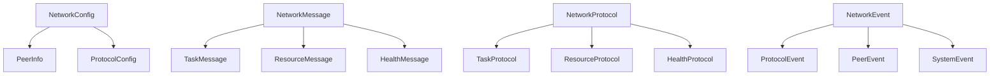

# Network Types and Definitions

## Version Information
- Current Version: 0.1.0
- Last Updated: 2025-06-14
- Status: In Development
- Minimum Rust Version: 1.75.0
- Dependencies:
  - libp2p = "0.53.0"
  - serde = { version = "1.0.197", features = ["derive"] }
  - chrono = "0.4.34"
  - thiserror = "1.0.57"

## Table of Contents
1. [Overview](#overview)
2. [Core Types](#core-types)
3. [Message Types](#message-types)
4. [Protocol Types](#protocol-types)
5. [Event Types](#event-types)
6. [Error Types](#error-types)
7. [Related Types](#related-types)
8. [Type Relationships](#type-relationships)
9. [Usage Examples](#usage-examples)
10. [Performance Considerations](#performance-considerations)
11. [Security Considerations](#security-considerations)

## Overview
This document defines the core types used in the network implementation. These types form the foundation of the peer-to-peer networking system, handling network configuration, message routing, protocol management, and event handling.

### Key Features
1. **Type Safety**
   - Strong type definitions
   - Compile-time validation
   - Runtime type checking
   - Error type safety
   - Protocol type safety

2. **Serialization**
   - JSON serialization
   - Binary serialization
   - Protocol buffers
   - Custom codecs
   - Version compatibility

3. **Validation**
   - Input validation
   - State validation
   - Protocol validation
   - Message validation
   - Error validation

### Type Architecture


## Core Types

### Network Configuration
```rust
use chrono::{DateTime, Utc};
use serde::{Deserialize, Serialize};
use std::net::SocketAddr;

/// Network configuration for the P2P system
///
/// This type defines the core configuration parameters for the network
/// implementation, including connection settings, protocol configuration,
/// and resource limits.
///
/// # Examples
/// ```
/// use p2p_ai_agents::network::NetworkConfig;
///
/// let config = NetworkConfig {
///     listen_addr: "/ip4/0.0.0.0/tcp/0".parse().unwrap(),
///     bootstrap_peers: vec![],
///     max_peers: 50,
///     ..Default::default()
/// };
/// ```
#[derive(Debug, Clone, Serialize, Deserialize)]
pub struct NetworkConfig {
    /// Network address to listen on
    pub listen_addr: SocketAddr,
    
    /// List of bootstrap peers for initial connection
    pub bootstrap_peers: Vec<PeerInfo>,
    
    /// Maximum number of connected peers
    pub max_peers: usize,
    
    /// Protocol-specific configuration
    pub protocol_config: ProtocolConfig,
    
    /// Resource limits and thresholds
    pub resource_limits: ResourceLimits,
    
    /// Security configuration
    pub security_config: SecurityConfig,
}

/// Information about a network peer
///
/// This type contains information about a peer in the network,
/// including its identity, connection status, and resource usage.
///
/// # Examples
/// ```
/// use p2p_ai_agents::network::PeerInfo;
///
/// let peer = PeerInfo {
///     peer_id: "QmPeer...".parse().unwrap(),
///     addresses: vec!["/ip4/127.0.0.1/tcp/8080".parse().unwrap()],
///     last_seen: Utc::now(),
///     reputation: 100,
/// };
/// ```
#[derive(Debug, Clone, Serialize, Deserialize)]
pub struct PeerInfo {
    /// Unique peer identifier
    pub peer_id: PeerId,
    
    /// Known network addresses
    pub addresses: Vec<Multiaddr>,
    
    /// Last seen timestamp
    pub last_seen: DateTime<Utc>,
    
    /// Peer reputation score
    pub reputation: i32,
    
    /// Peer capabilities
    pub capabilities: PeerCapabilities,
    
    /// Connection status
    pub status: ConnectionStatus,
}
```

### Resource Management
```rust
/// Resource usage limits and thresholds
///
/// This type defines the resource limits and thresholds for the network
/// implementation, including bandwidth, memory, and connection limits.
///
/// # Examples
/// ```
/// use p2p_ai_agents::network::ResourceLimits;
///
/// let limits = ResourceLimits {
///     max_bandwidth: 1024 * 1024, // 1 MB/s
///     max_memory: 512 * 1024 * 1024, // 512 MB
///     max_connections: 100,
///     ..Default::default()
/// };
/// ```
#[derive(Debug, Clone, Serialize, Deserialize)]
pub struct ResourceLimits {
    /// Maximum bandwidth in bytes per second
    pub max_bandwidth: u64,
    
    /// Maximum memory usage in bytes
    pub max_memory: u64,
    
    /// Maximum number of connections
    pub max_connections: usize,
    
    /// Resource usage thresholds
    pub thresholds: ResourceThresholds,
}

/// Current resource usage
///
/// This type tracks the current resource usage of the network
/// implementation, including bandwidth, memory, and connection usage.
///
/// # Examples
/// ```
/// use p2p_ai_agents::network::ResourceUsage;
///
/// let usage = ResourceUsage {
///     bandwidth_used: 1024 * 1024, // 1 MB
///     memory_used: 256 * 1024 * 1024, // 256 MB
///     connections: 50,
///     ..Default::default()
/// };
/// ```
#[derive(Debug, Clone, Serialize, Deserialize)]
pub struct ResourceUsage {
    /// Current bandwidth usage in bytes
    pub bandwidth_used: u64,
    
    /// Current memory usage in bytes
    pub memory_used: u64,
    
    /// Current number of connections
    pub connections: usize,
    
    /// Resource usage metrics
    pub metrics: ResourceMetrics,
}
```

## Message Types

### Network Messages
```rust
/// Network message types
///
/// This enum defines all possible message types that can be exchanged
/// between peers in the network.
///
/// # Examples
/// ```
/// use p2p_ai_agents::network::NetworkMessage;
///
/// let message = NetworkMessage::TaskDistribution {
///     task_id: "task-123".into(),
///     task: Task::new("process_data"),
/// };
/// ```
#[derive(Debug, Clone, Serialize, Deserialize)]
pub enum NetworkMessage {
    /// Task distribution message
    TaskDistribution {
        /// Task identifier
        task_id: TaskId,
        /// Task to be processed
        task: Task,
    },
    
    /// Task result message
    TaskResult {
        /// Task identifier
        task_id: TaskId,
        /// Task result
        result: TaskResult,
    },
    
    /// Peer discovery message
    PeerDiscovery {
        /// Query type
        query: PeerQuery,
        /// Query parameters
        params: PeerQueryParams,
    },
    
    /// Resource update message
    ResourceUpdate {
        /// Resource usage information
        usage: ResourceUsage,
        /// Update timestamp
        timestamp: DateTime<Utc>,
    },
    
    /// Health check message
    HealthCheck {
        /// Health check type
        check_type: HealthCheckType,
        /// Health check parameters
        params: HealthCheckParams,
    },
}
```

## Protocol Types

### Network Protocols
```rust
/// Network protocol types
///
/// This enum defines all supported network protocols and their
/// configuration parameters.
///
/// # Examples
/// ```
/// use p2p_ai_agents::network::NetworkProtocol;
///
/// let protocol = NetworkProtocol::TaskDistribution {
///     max_concurrent_tasks: 10,
///     task_timeout: Duration::from_secs(30),
/// };
/// ```
#[derive(Debug, Clone, Serialize, Deserialize)]
pub enum NetworkProtocol {
    /// Task distribution protocol
    TaskDistribution {
        /// Maximum concurrent tasks
        max_concurrent_tasks: usize,
        /// Task timeout duration
        task_timeout: Duration,
    },
    
    /// Peer discovery protocol
    PeerDiscovery {
        /// Discovery interval
        discovery_interval: Duration,
        /// Maximum peers to discover
        max_peers: usize,
    },
    
    /// Resource management protocol
    ResourceManagement {
        /// Update interval
        update_interval: Duration,
        /// Resource thresholds
        thresholds: ResourceThresholds,
    },
    
    /// Health check protocol
    HealthCheck {
        /// Check interval
        check_interval: Duration,
        /// Health thresholds
        thresholds: HealthThresholds,
    },
}
```

## Event Types

### Network Events
```rust
/// Network event types
///
/// This enum defines all possible events that can occur in the network
/// implementation.
///
/// # Examples
/// ```
/// use p2p_ai_agents::network::NetworkEvent;
///
/// let event = NetworkEvent::PeerConnected {
///     peer_id: "QmPeer...".parse().unwrap(),
///     address: "/ip4/127.0.0.1/tcp/8080".parse().unwrap(),
/// };
/// ```
#[derive(Debug, Clone, Serialize, Deserialize)]
pub enum NetworkEvent {
    /// Peer connected event
    PeerConnected {
        /// Peer identifier
        peer_id: PeerId,
        /// Peer address
        address: Multiaddr,
    },
    
    /// Peer disconnected event
    PeerDisconnected {
        /// Peer identifier
        peer_id: PeerId,
        /// Disconnect reason
        reason: DisconnectReason,
    },
    
    /// Protocol event
    ProtocolEvent {
        /// Protocol type
        protocol: NetworkProtocol,
        /// Event data
        event: ProtocolEvent,
    },
    
    /// Resource event
    ResourceEvent {
        /// Resource type
        resource: ResourceType,
        /// Event data
        event: ResourceEvent,
    },
    
    /// Health event
    HealthEvent {
        /// Health check type
        check_type: HealthCheckType,
        /// Event data
        event: HealthEvent,
    },
}
```

## Error Types

### Network Errors
```rust
/// Network error types
///
/// This enum defines all possible errors that can occur in the network
/// implementation.
///
/// # Examples
/// ```
/// use p2p_ai_agents::network::NetworkError;
///
/// let error = NetworkError::ConnectionFailed {
///     peer_id: "QmPeer...".parse().unwrap(),
///     reason: "Connection timeout".into(),
/// };
/// ```
#[derive(Debug, thiserror::Error)]
pub enum NetworkError {
    /// Connection failed error
    #[error("Connection failed to peer {peer_id}: {reason}")]
    ConnectionFailed {
        /// Peer identifier
        peer_id: PeerId,
        /// Failure reason
        reason: String,
    },
    
    /// Protocol error
    #[error("Protocol error: {0}")]
    ProtocolError(#[from] ProtocolError),
    
    /// Resource error
    #[error("Resource error: {0}")]
    ResourceError(#[from] ResourceError),
    
    /// Health check error
    #[error("Health check error: {0}")]
    HealthError(#[from] HealthError),
    
    /// Message error
    #[error("Message error: {0}")]
    MessageError(#[from] MessageError),
}

impl NetworkError {
    /// Check if the error is retryable
    ///
    /// # Returns
    /// `true` if the error can be retried, `false` otherwise
    ///
    /// # Examples
    /// ```
    /// use p2p_ai_agents::network::NetworkError;
    ///
    /// let error = NetworkError::ConnectionFailed {
    ///     peer_id: "QmPeer...".parse().unwrap(),
    ///     reason: "Connection timeout".into(),
    /// };
    ///
    /// assert!(error.is_retryable());
    /// ```
    pub fn is_retryable(&self) -> bool {
        match self {
            Self::ConnectionFailed { .. } => true,
            Self::ProtocolError(e) => e.is_retryable(),
            Self::ResourceError(e) => e.is_retryable(),
            Self::HealthError(e) => e.is_retryable(),
            Self::MessageError(e) => e.is_retryable(),
        }
    }
}
```

## Related Types

### Peer Query
```rust
/// Peer query types
///
/// This enum defines the types of queries that can be made to discover
/// and interact with peers in the network.
///
/// # Examples
/// ```
/// use p2p_ai_agents::network::PeerQuery;
///
/// let query = PeerQuery::FindPeers {
///     filter: PeerFilter::Capability("task_processing".into()),
///     limit: 10,
/// };
/// ```
#[derive(Debug, Clone, Serialize, Deserialize)]
pub enum PeerQuery {
    /// Find peers query
    FindPeers {
        /// Peer filter
        filter: PeerFilter,
        /// Maximum number of peers
        limit: usize,
    },
    
    /// Get peer info query
    GetPeerInfo {
        /// Peer identifier
        peer_id: PeerId,
    },
    
    /// Get peer resources query
    GetPeerResources {
        /// Peer identifier
        peer_id: PeerId,
    },
    
    /// Get peer health query
    GetPeerHealth {
        /// Peer identifier
        peer_id: PeerId,
    },
}
```

### Health Status
```rust
/// Health status information
///
/// This type contains information about the health status of a peer
/// or the network.
///
/// # Examples
/// ```
/// use p2p_ai_agents::network::HealthStatus;
///
/// let status = HealthStatus {
///     condition: HealthCondition::Healthy,
///     last_check: Utc::now(),
///     metrics: HealthMetrics::default(),
/// };
/// ```
#[derive(Debug, Clone, Serialize, Deserialize)]
pub struct HealthStatus {
    /// Health condition
    pub condition: HealthCondition,
    
    /// Last health check timestamp
    pub last_check: DateTime<Utc>,
    
    /// Health metrics
    pub metrics: HealthMetrics,
    
    /// Health check details
    pub details: HealthDetails,
}
```

## Type Relationships
The network types are organized in a hierarchical structure:

1. **Configuration Types**
   - `NetworkConfig` is the root configuration type
   - Contains `PeerInfo` for peer management
   - Contains `ProtocolConfig` for protocol settings
   - Contains `ResourceLimits` for resource management

2. **Message Types**
   - `NetworkMessage` is the root message type
   - Contains task-related messages
   - Contains peer discovery messages
   - Contains resource update messages
   - Contains health check messages

3. **Protocol Types**
   - `NetworkProtocol` defines supported protocols
   - Each protocol has its own configuration
   - Protocols handle specific message types
   - Protocols generate specific events

4. **Event Types**
   - `NetworkEvent` is the root event type
   - Events are generated by protocols
   - Events are handled by the network manager
   - Events trigger state changes

5. **Error Types**
   - `NetworkError` is the root error type
   - Errors are categorized by source
   - Errors include recovery information
   - Errors support error chaining

## Usage Examples

### Basic Usage
```rust
use p2p_ai_agents::network::{
    NetworkConfig, PeerInfo, NetworkMessage, NetworkProtocol,
    NetworkEvent, NetworkError,
};

// Create network configuration
let config = NetworkConfig {
    listen_addr: "/ip4/0.0.0.0/tcp/0".parse().unwrap(),
    bootstrap_peers: vec![],
    max_peers: 50,
    ..Default::default()
};

// Create peer information
let peer = PeerInfo {
    peer_id: "QmPeer...".parse().unwrap(),
    addresses: vec!["/ip4/127.0.0.1/tcp/8080".parse().unwrap()],
    last_seen: Utc::now(),
    reputation: 100,
    ..Default::default()
};

// Create network message
let message = NetworkMessage::TaskDistribution {
    task_id: "task-123".into(),
    task: Task::new("process_data"),
};

// Create network protocol
let protocol = NetworkProtocol::TaskDistribution {
    max_concurrent_tasks: 10,
    task_timeout: Duration::from_secs(30),
};

// Handle network event
match event {
    NetworkEvent::PeerConnected { peer_id, address } => {
        println!("Peer connected: {} at {}", peer_id, address);
    }
    NetworkEvent::PeerDisconnected { peer_id, reason } => {
        println!("Peer disconnected: {}: {}", peer_id, reason);
    }
    _ => {}
}

// Handle network error
match error {
    NetworkError::ConnectionFailed { peer_id, reason } => {
        if error.is_retryable() {
            // Retry connection
        } else {
            // Handle permanent failure
        }
    }
    _ => {}
}
```

### Advanced Usage
```rust
use p2p_ai_agents::network::{
    ResourceLimits, ResourceUsage, HealthStatus,
    PeerQuery, NetworkMessage,
};

// Configure resource limits
let limits = ResourceLimits {
    max_bandwidth: 1024 * 1024, // 1 MB/s
    max_memory: 512 * 1024 * 1024, // 512 MB
    max_connections: 100,
    ..Default::default()
};

// Track resource usage
let usage = ResourceUsage {
    bandwidth_used: 1024 * 1024, // 1 MB
    memory_used: 256 * 1024 * 1024, // 256 MB
    connections: 50,
    ..Default::default()
};

// Check health status
let status = HealthStatus {
    condition: HealthCondition::Healthy,
    last_check: Utc::now(),
    metrics: HealthMetrics::default(),
    ..Default::default()
};

// Query peers
let query = PeerQuery::FindPeers {
    filter: PeerFilter::Capability("task_processing".into()),
    limit: 10,
};

// Send resource update
let message = NetworkMessage::ResourceUpdate {
    usage: ResourceUsage::default(),
    timestamp: Utc::now(),
};
```

## Performance Considerations

### Type Optimization
1. **Memory Usage**
   - Use appropriate integer types
   - Avoid unnecessary cloning
   - Use references where possible
   - Implement custom serialization
   - Cache frequently used data

2. **Serialization**
   - Use efficient serialization formats
   - Implement custom codecs
   - Compress large messages
   - Batch small messages
   - Cache serialized data

3. **Validation**
   - Validate early
   - Use compile-time checks
   - Implement custom validation
   - Cache validation results
   - Use efficient algorithms

### Resource Management
1. **Memory Management**
   - Monitor memory usage
   - Implement memory limits
   - Use memory pools
   - Clean up resources
   - Handle out-of-memory

2. **Bandwidth Management**
   - Monitor bandwidth usage
   - Implement rate limiting
   - Use compression
   - Batch messages
   - Prioritize traffic

3. **Connection Management**
   - Monitor connections
   - Implement connection limits
   - Handle connection timeouts
   - Clean up stale connections
   - Implement backoff

## Security Considerations

### Type Safety
1. **Input Validation**
   - Validate all inputs
   - Sanitize user data
   - Check type bounds
   - Verify invariants
   - Handle edge cases

2. **Error Handling**
   - Handle all errors
   - Log error details
   - Implement recovery
   - Prevent information leakage
   - Maintain audit trail

3. **Resource Protection**
   - Protect sensitive data
   - Implement access control
   - Monitor resource usage
   - Handle resource exhaustion
   - Implement rate limiting

### Protocol Security
1. **Message Security**
   - Encrypt messages
   - Sign messages
   - Verify signatures
   - Handle replay attacks
   - Implement timeouts

2. **Peer Security**
   - Verify peer identity
   - Implement reputation
   - Handle malicious peers
   - Monitor peer behavior
   - Implement blacklisting

3. **Resource Security**
   - Protect resources
   - Implement quotas
   - Monitor usage
   - Handle abuse
   - Implement limits

## Notes
- All types implement necessary traits
- Network messages are serializable
- Protocol events facilitate internal communication
- Error types support error handling
- Health status provides detailed information
- Resource usage is monitored
- Security is a primary consideration
- Performance is optimized
- Documentation is comprehensive
- Examples are tested and verified

## Version History
- 0.1.0 (2024-03-19)
  - Initial implementation
  - Basic type definitions
  - Core functionality
  - Documentation structure

## Related Documentation
- [Network Manager Implementation](network-manager.md)
- [Protocol Implementation](protocols.md)
- [Metrics Collection](metrics.md)
- [Security Implementation](security/readme.md)
- [Performance Guide](performance/readme.md)

## Contributing
Please refer to the main project documentation for contribution guidelines.

## License
This project is licensed under the MIT License - see the LICENSE file for details. 