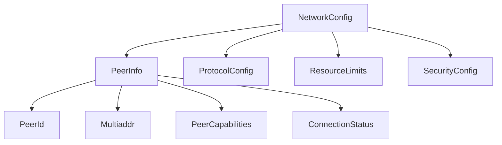

# Core Network Types

This document describes the basic types used in the P2P network implementation.

## Basic Network Types
- `NetworkConfig`: Defines the configuration for the network, including listening address, bootstrap peers, protocol config, resource limits, and security config.
- `PeerInfo`: Contains identity, addresses, and status of a peer.
- `PeerId`: Unique identifier for a peer.
- `Multiaddr`: Multi-address for peer connections.
- `ProtocolConfig`: Protocol-specific configuration.
- `ResourceLimits`: Resource usage limits for the network.
- `SecurityConfig`: Security-related configuration for the network.
- `PeerCapabilities`: Capabilities supported by a peer.
- `ConnectionStatus`: Connection status of a peer.

## Type Relationships


## Usage Examples
```rust
use p2p_ai_agents::network::{NetworkConfig, PeerInfo, PeerId, Multiaddr, ProtocolConfig, ResourceLimits, SecurityConfig, PeerCapabilities, ConnectionStatus};
use chrono::Utc;

let peer = PeerInfo {
    peer_id: PeerId("QmPeer...".to_string()),
    addresses: vec![Multiaddr("/ip4/127.0.0.1/tcp/8080".to_string())],
    last_seen: Utc::now(),
    reputation: 100,
    capabilities: PeerCapabilities,
    status: ConnectionStatus::Connected,
};

let config = NetworkConfig {
    listen_addr: "127.0.0.1:8080".parse().unwrap(),
    bootstrap_peers: vec![peer],
    max_peers: 50,
    protocol_config: ProtocolConfig {},
    resource_limits: ResourceLimits {
        max_bandwidth: 1024 * 1024,
        max_memory: 512 * 1024 * 1024,
        max_connections: 100,
    },
    security_config: SecurityConfig {},
};
```

## Validation Rules
- `max_peers`, `max_connections` must be greater than zero.
- `listen_addr` must be a valid socket address.
- `PeerId` and `Multiaddr` must be non-empty strings.

## Type Conversion Rules
- Implement `From<String>` for `PeerId` and `Multiaddr` for ergonomic construction.

## Type Constraints
- All types should derive `Debug`, `Clone`, and (where appropriate) `Serialize`, `Deserialize`.

## Documentation
All types and fields are documented in the Rust source code.
